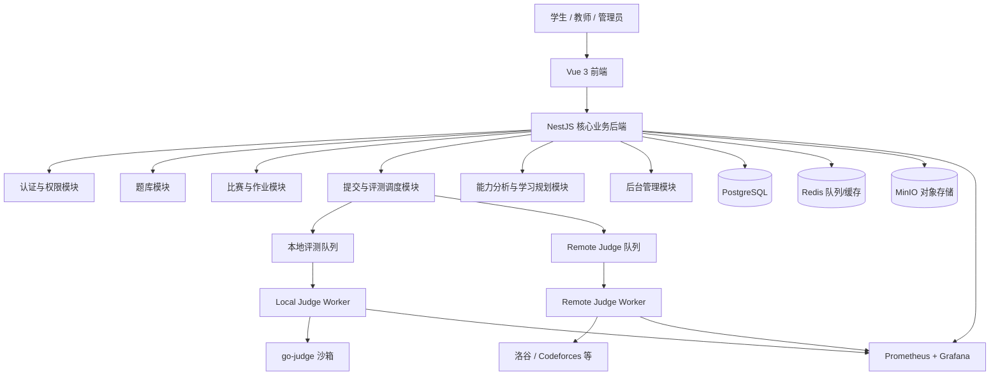

# 西财 OJ 平台

> 面向高校的「统一题库 + 在线评测 + 教学管理 + 竞赛训练」综合性平台

[](LICENSE)
[](https://nodejs.org)
[](https://www.typescriptlang.org/)
[](https://www.docker.com/)
[](https://nestjs.com/)
[](https://vuejs.org/)

---

## 📖 平台定位

西财 OJ 不是单纯的在线评测系统，而是由四个平台融合而成：

| 平台 | 定位 |
|------|------|
| 🏫 **统一题库平台** | 聚合本地题目与第三方 OJ 题目（洛谷、Codeforces 等），支持题目版本管理、难度标签体系、题单收藏 |
| ⚡ **统一评测平台** | 自建沙箱本地评测 + 插件式 Remote Judge 适配器框架，C/C++/Python/Java 等多语言实时编译执行 |
| 👨‍🏫 **教学管理平台** | 班级与课程管理、作业布置与批改、学生能力画像、成绩统计与报告导出 |
| 🏆 **竞赛训练平台** | ACM/ICPC 与 IOI 双赛制、封榜排名、专项训练计划、个人能力雷达图 |

---

## ✨ 核心能力

### 评测系统

```
用户提交 → 统一提交服务
              ├── 本地题目 → Local Judge Worker → 沙箱执行 → 结果比对
              └── 外部题目 → Remote Judge Worker → 第三方 OJ
```

- **真实编译执行**：g++ / gcc / python3 / javac 编译后执行，非模拟
- **多语言支持**：C、C++、Python、Java
- **15 种统一评测状态**：AC / WA / TLE / MLE / RE / CE / OLE / PE / SYSTEM_ERROR / CANCELLED / REMOTE_ERROR 等
- **测试点分组计分**：支持子任务、部分分
- **后续扩展**：Special Judge、交互题、提交答案题、多文件题

### 三种角色权限体系

| 角色 | 核心权限 |
|------|----------|
| 🎓 **学生** | 浏览题库、提交代码、查看评测结果、参加比赛、查看能力画像、获取训练推荐 |
| 👨‍🏫 **教师** | 创建班级、导入学生、布置作业、创建题目与比赛、上传测试数据、查看班级统计、导出成绩 |
| 🛡️ **管理员** | 用户管理、角色分配、题目审核、OJ 适配器管理、评测队列监控、系统配置、审计日志 |

可扩展角色：题目审核员、出题人、比赛管理员、助教、学校管理员。

### Remote Judge 适配器

采用插件式架构，统一 `RemoteJudgeAdapter` 接口，分四个接入等级：

| 等级 | 模式 | 说明 |
|------|------|------|
| A | 官方评测 API | 洛谷等提供正式提交和查询接口 |
| B | 官方授权适配 | 无标准 API 但已取得授权 |
| C | 非官方网页适配 | 模拟登录提交，稳定性较低 |
| D | 仅同步元数据 | 同步题目、难度、标签和原站链接 |

平台接入优先级：洛谷 (P0) > Codeforces / QOJ (P1) > AtCoder / CodeChef / LeetCode (P2)

#### AtCoder 当前实现

AtCoder 按只读 C 级能力接入：管理员可在 `/admin/import-atcoder` 按单个公开题目 URL 导入标题、时间限制、内存限制和远程标识，题目详情始终提供规范化原站链接。平台不复制完整题面，不保存 AtCoder Cookie/CSRF/密码，也不执行远程提交或结果轮询。

自动提交在数据库平台配置和提交服务中均强制关闭。启用更高等级前，必须先取得 AtCoder 对教育项目自动提交与结果读取的明确许可，并完成 Helper 签名、幂等和竞赛限制验收。完整边界见 [`docs/vjudge-platforms/03-atcoder.md`](docs/vjudge-platforms/03-atcoder.md)。

拉取本次更新后执行：

```bash
cd packages/backend
npx prisma db push
npx prisma generate
```

### 教学与竞赛

- **作业系统**：截止时间、补交规则、通过条件、完成率统计、错误类型分布
- **比赛系统**：ACM/ICPC（罚时）、IOI（分数）双模式，支持封榜、实时排名、赛后补题
- **能力分析**：知识点体系 → 用户能力向量 → 薄弱项识别 → 个性化训练计划
- **学习规划**：每日训练 / 周计划 / 月计划，50% 薄弱点 + 30% 巩固 + 20% 挑战题

---

## 🛠 技术栈

| 层级 | 技术 | 选型理由 |
|------|------|----------|
| **前端** | Vue 3 + TypeScript + Vite 5 | 前后端统一语言，Vite 极速构建 |
| **状态管理** | Pinia 2 | Vue 3 官方推荐，简洁类型安全 |
| **路由** | Vue Router 4 | SPA history 模式 |
| **HTTP** | Axios | Token 自动刷新拦截器 |
| **后端** | NestJS 11 + TypeScript | 模块边界清晰，适合权限/队列/WebSocket |
| **ORM** | Prisma 5 | 类型安全，自动迁移，47 表完整模型 |
| **队列** | BullMQ + Redis 7 | 评测任务异步调度，指数退避重试 |
| **认证** | Passport + JWT | Access Token (15min 内存) + Refresh Token (7d Rotation) |
| **数据库** | PostgreSQL 16 | 教育场景天然适合关系型，JSONB 覆盖灵活字段 |
| **存储** | MinIO (S3 兼容) | 自建对象存储，测试数据/图片/附件 |
| **评测沙箱** | go-judge (生产) / child_process (开发) | go-judge 基于 cgroup + seccomp 隔离 |
| **部署** | Docker Compose + Nginx | 初期三机部署，后期平滑升级 K8s |
| **监控** | Prometheus + Grafana + Loki + Sentry | 全链路可观测 |

---

## 🚀 快速开始

### 前提条件

- Node.js >= 20.11
- Docker Desktop（含 Docker Compose）
- g++ / python3（评测编译执行）
- Windows 用户建议启用 WSL2

### 克隆与安装

```bash
git clone https://github.com/your-org/swufe-oj.git
cd swufe-oj
```

### 启动基础设施

```bash
docker compose up -d
# 启动 PostgreSQL 16 + Redis 7 + MinIO + go-judge
```

### 初始化后端

```bash
cd packages/backend
cp ../../config/.env.example .env
npm install
npx prisma migrate deploy
npx prisma generate
npm run seed            # 导入洛谷 P1000-P1010 共 11 道题目
npm run start:dev       # 启动开发服务器 (localhost:3000)
```

### 构建前端

```bash
cd packages/frontend
npm install
npm run build           # 构建产物输出到 dist/
```

访问 http://127.0.0.1:3000，前后端统一端口，零跨域。

---

## 🧪 测试账号

| 角色 | 用户名 | 密码 |
|------|--------|------|
| 管理员 | `admin` | `123456` |
| 教师 | `teacher` | `123456` |
| 学生 | `stu` | `123456` |

这三个账号已预置在当前开发数据库中，用于验收不同权限：管理员可进行平台管理，教师可创建教学与比赛内容，学生用于普通学习和参赛流程验证。请仅用于本地测试，正式部署前请修改密码或重新创建账号。

如需手动注册：打开页面 → 点击右上角「登录」→ 切换到「注册」→ 填写信息即可。

---

## 🏗 系统架构



**核心设计原则**：
- **模块化单体 + 独立 Worker**：核心业务集中，评测/同步/分析等高风险模块独立运行
- **业务平台与评测沙箱物理分离**：评测节点不能直接访问生产数据库
- **本地与 Remote Judge 统一入口、分离流程**

---

## 📊 数据模型（47 表）

| 模块 | 核心表 |
|------|--------|
| **用户与权限** | User, Role, Permission, UserRole, UserSession, ExternalAccount |
| **题库** | Problem, ProblemSource, ProblemVersion, ProblemTag, TestGroup, Checker, ProblemList |
| **提交与评测** | Submission, SubmissionCase, JudgeTask, RemoteJudgeJob, JudgeNode, JudgeLanguage |
| **比赛** | Contest, ContestProblem, ContestParticipant, ContestSubmission, ContestRankSnapshot |
| **教学** | Organization, Course, Class, ClassMember, Assignment, AssignmentProblem, AssignmentStudent |
| **能力分析** | KnowledgePoint, KnowledgeRelation, UserSkillProfile, UserProblemMetric, LearningPlan |
| **系统审计** | AuditLog, SystemConfig, VerdictMapping |

---

## 📂 项目结构

```
西财OJ平台/
├── docker-compose.yml             # 基础设施一键编排
├── config/.env.example            # 环境变量模板
├── packages/
│   ├── backend/                   # NestJS 后端
│   │   ├── prisma/
│   │   │   ├── schema.prisma      # 47 表 Prisma Schema
│   │   │   └── seed.ts            # P1000-P1010 种子数据
│   │   └── src/
│   │       ├── auth/              # JWT 认证 + Passport 策略
│   │       ├── problem/           # 题目 CRUD + 批量导入 API
│   │       ├── submission/        # 提交入队 + BullMQ 评测队列
│   │       └── judge/             # 评测引擎 (go-judge / Native)
│   └── frontend/                  # Vue 3 前端
│       ├── src/
│       │   ├── views/             # 首页/登录/题库/题目详情/提交/导入
│       │   ├── api/               # Axios + Token 拦截刷新
│       │   ├── stores/            # Pinia 认证状态
│       │   └── router/            # Vue Router 路由定义
│       └── scripts/               # 构建数据注入脚本
├── docs/
│   ├── PROJECT_LOG.md             # 开发日志
│   └── SETUP.md                   # 详细搭建指南
├── 方案.md                        # 完整项目方案文档 (V0.2)
└── README.md                      # 本文件
```

---

## 🔒 安全设计

### 代码执行隔离

```
禁用外网 | 只读根文件系统 | 临时工作目录 | 非 root 用户
限制进程数 | 限制 CPU 和内存 | seccomp 系统调用过滤
任务完成后立即销毁环境
```

- **Fork Bomb / 内存耗尽 / 磁盘写满 / 系统调用逃逸**：8 项安全测试全部通过方可上线
- **服务器隔离**：业务节点（API + DB）与评测节点（沙箱 + Worker）物理分离

### Token 安全

- Access Token：15 分钟，仅存前端内存（不写 localStorage，防 XSS）
- Refresh Token：7 天，HttpOnly Secure SameSite Cookie，使用后立即轮换
- 检测到 Token 重放 → 作废该用户全部会话

### Remote Judge 凭据

- Token/Cookie/密码 → AES 加密存储
- 仅 Worker 可解密，不入日志、不传前端
- 管理员只能看到脱敏信息

---

## 🗺 开发路线

| 阶段 | 内容 | 状态 |
|------|------|------|
| **阶段 1** | 基础平台 MVP — 认证 / 题库 / 本地评测 / 远程评测基础接入 / 管理后台 | ✅ 完成 |
| **阶段 2** | 教学和比赛 — 班级 / 课程 / 作业 / ACM & IOI 比赛 / 排行榜 / 数据导出 | 🔨 进行中 |
| **阶段 3** | Remote Judge 生产化 — 多平台适配器 / 账号池 / 熔断限流 / 健康监控 | 📋 计划中 |
| **阶段 4** | 能力分析 — 知识点体系 / 用户能力画像 / 规则式推荐 / 学习规划 | 📋 计划中 |
| **阶段 5** | 生产强化 — Special Judge / 交互题 / 代码查重 / 高可用 / 压力测试 | 📋 计划中 |

### MVP 验收标准（15 项）

1. ✅ 学生、教师、管理员三角色登录
2. ✅ 角色分配和权限控制
3. ✅ 教师创建班级和导入学生
4. ✅ 教师创建题目并上传测试数据
5. ✅ 学生用 C++ / Python / Java 提交代码
6. ✅ 正确返回 AC / WA / TLE / RE / CE
7. ✅ 教师创建 ACM 模式比赛
8. ✅ 管理本地和外部题目
9. ✅ 洛谷官方 Remote Judge 接入
10. ✅ 不支持的平台跳转原站
11. ✅ 教师查看班级统计
12. ✅ 学生能力雷达图与推荐
13. ✅ 管理员查看评测队列与节点状态
14. ✅ 用户代码运行环境与业务隔离
15. ✅ 数据库和配置定期备份

---

## ⚠️ 主要风险与对策

| 风险 | 对策 |
|------|------|
| 第三方 OJ 不提供提交 API | 降级为元数据同步 + 原站跳转 |
| 网页结构变化 / 验证码 | 适配器隔离、健康检查自动暂停，不绕过安全措施 |
| 用户代码攻击服务器 | 独立评测节点 + go-judge 强沙箱 + seccomp |
| 沙箱逃逸漏洞 | 8 项安全测试，定期复测 |
| 测试数据泄露 | MinIO 权限隔离 + 下载审计 |
| Redis 故障丢任务 | AOF 持久化 + RDB 快照，生产部署 Sentinel |
| 题目版权问题 | 保存来源授权，优先展示原题链接 |
| 系统范围过大 | 严格按 MVP 阶段建设，不做过度设计 |

---

## 🤝 贡献

```bash
git clone https://github.com/your-org/swufe-oj.git
git checkout -b feature/your-feature
git commit -m 'feat: add your feature'
git push origin feature/your-feature
# 提交 Pull Request
```

欢迎提交 Issue 和 PR。

---

## 📄 许可证

MIT License

---

## 🔗 参考

| 项目 | 说明 |
|------|------|
| [HydroOJ](https://github.com/hydro-dev/Hydro) | Node.js OJ 架构参考，Remote Judge 适配器设计 |
| [go-judge](https://github.com/criyle/go-judge) | 评测沙箱引擎，cgroup + seccomp |
| [SYZOJ](https://github.com/syzoj/syzoj) | Node.js OJ，评测队列调度参考 |
| [QDUOJ](https://github.com/QingdaoU/OnlineJudge) | Python OJ，Docker 部署参考 |
| [洛谷](https://www.luogu.com.cn) | Remote Judge 官方 API |
