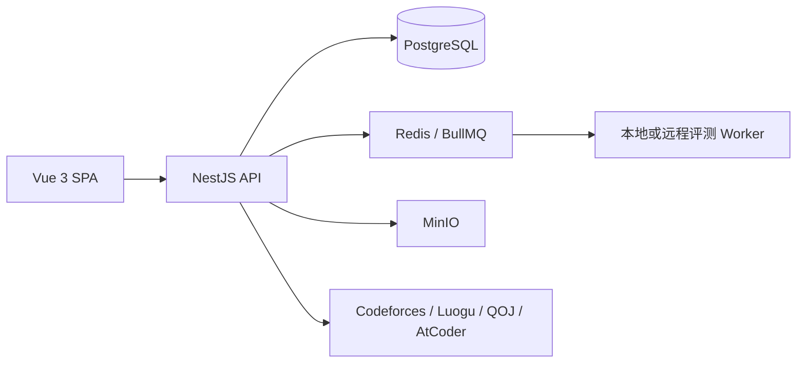

# SWUFE Singularity OJ 项目交接说明

> 更新日期：2026-07-22
>
> 交接基线：分支 `42411109`，提交 `5e195f3 feat: add student class assignments`

## 1. 项目是什么

SWUFE Singularity OJ 是面向高校教学和竞赛训练的综合在线评测平台，目标是把题库、代码评测、班级教学、作业、比赛、社区与学习分析放在同一套账号和权限体系内。

当前项目不是从零开始的原型：认证、题库、提交评测、班级、作业、比赛、社区和通知已有可运行实现。项目正在从“基础功能可用”推进到“教学闭环可靠、体验完整、可生产化部署”。

## 2. 当前代码与运行状态

| 项目项 | 当前状态 |
| --- | --- |
| 当前开发分支 | `42411109` |
| 当前基线提交 | `5e195f3` |
| 后端 | NestJS 11 + Prisma 5 + PostgreSQL + Redis/BullMQ |
| 前端 | Vue 3 + TypeScript + Vite + Pinia + Vue Router |
| 开发前端 | `http://127.0.0.1:5174/` |
| 开发后端 | `http://127.0.0.1:3000/` |
| 前端验证 | 6 个 Vitest 套件、15 项测试通过；生产构建通过 |
| 后端验证 | 32 个 Jest 套件、204 项测试通过；生产构建通过 |

本地服务当前已从 `42411109` 工作树启动。未登录访问 `/api/community/posts` 与 `/api/user/classes/:classId/assignments` 已运行态验证为 `401`。

## 3. 架构概览



主要目录：

| 路径 | 责任 |
| --- | --- |
| `packages/backend/src/auth` | 登录、刷新令牌、JWT 与会话控制 |
| `packages/backend/src/problem` | 题库、筛选、标签、题目版本和来源 |
| `packages/backend/src/submission`、`judge` | 提交、队列、判题与结果状态 |
| `packages/backend/src/teacher`、`user` | 班级、学生成员、作业和教学数据 |
| `packages/backend/src/community`、`message` | 讨论、审核、通知和私信 |
| `packages/backend/prisma` | Prisma Schema、迁移与种子数据 |
| `packages/frontend/src/views` | 学生、教师、管理员业务页面 |
| `packages/frontend/src/router` | 路由与全局登录/角色守卫 |
| `docs/superpowers` | 已完成功能的设计与实施计划记录 |

## 4. 已完成且可继续使用的能力

### 4.1 账号、角色与安全

- 学生、教师、管理员角色与路由/接口权限校验。
- JWT Access Token 与 HttpOnly Refresh Cookie 的恢复、刷新与登出流程。
- 首次登录强制改密、用户资料维护、管理员用户/角色管理。
- 社区、私信、通知、班级和作业均已置于认证边界内。
- 社区入口 `/community` 以及公告、帖子列表接口均要求登录，不能再通过直接访问页面或列表 API 绕过。

### 4.2 题库、提交与评测

- 本地题目 CRUD、发布状态、标签、难度、来源、题单与题目历史管理。
- 题库可按关键词、来源、标签、难度筛选；外部平台来源会按 `sourceInfo.platform` 处理。
- C/C++、Python、Java 的本地编译、执行和判题流程；提交状态和成绩可回显。
- Codeforces 已有账号关联、已通过题同步与自动提交相关实现；QOJ、洛谷、AtCoder 有各自适配或导入边界。
- AtCoder 当前仅为只读题目导入，不应扩展为未授权的自动提交。

### 4.3 教师班级与作业

- 教师可创建班级、导入学生、生成/管理班级码、审核入班申请、移除成员。
- 教师班级工作台默认收起侧栏，支持直接切换多个班级。
- 发布作业已升级为题库工作台：关键词/来源/标签/难度筛选、分页、单题与当前页批量选择、跨页题单、移除和清空。
- 教师发布作业后会创建 `Assignment`、题目关联、正式学生关联，并对每位正式学生创建 `ASSIGNMENT` 站内通知。
- 通知链接为 `/classes/:classId/assignments?assignment=:assignmentId`，可直达对应作业。

### 4.4 学生班级作业闭环

- 学生在“我的班级”中，只有审核通过的班级显示“班级作业”入口。
- 新页面 `/classes/:classId/assignments` 显示作业、题目、开始/截止时间和完成进度。
- 后端 `GET /api/user/classes/:classId/assignments` 会校验学生为该班 `APPROVED` 成员；待审核、已拒绝或非成员不能读取。
- 完成进度按该学生在作业起止时间内的本地 `ACCEPTED` 提交计算。
- 每道作业题跳转到既有 `/problems/:id` 页面完成，避免重复建设提交编辑器和判题流程。
- 页面通过请求序号防止快速切换班级后旧请求覆盖新班级数据。

### 4.5 社区、通知与私信

- 社区支持发讨论、图片、回复、回复的回复、回复点赞、举报与内容审核入口。
- 头像可打开用户卡片并发起私信。
- 私信遵循“发起方在对方首次回复前只能发一条；对方回复后解除限制”的对话规则。
- 通知中心支持已读、全部已读、分类与通知跳转；作业通知已归入活动通知。

### 4.6 比赛、排行榜和学习能力

- 比赛页、排行榜、签到、题单、学习计划和个人资料页面已有实现。
- 比赛、班级、社区、通知等工作台侧栏默认收起，并针对移动端提供展开或横向布局。
- 这部分需要后续以端到端场景重新验收，不能只以页面存在视为功能完全闭环。

## 5. 最近完成的改动

| 提交 | 内容 |
| --- | --- |
| `5e195f3` | 学生班级作业页面、正式成员授权、作业通知、社区登录限制、截止时间时区与请求竞态修复 |
| `e2a56af` | 教师发布作业的题库行点击选择与移动端当前页选择优化 |
| `9b97b76` | 作业工作台审查问题修复 |
| `0236165` | 教师班级直接切换、筛选题库、批量题单工作台 |
| `b331ad6` | 社区讨论、嵌套回复、图片、私信和通知体验增强 |
| `308926a` | 工作台侧栏默认收起及响应式行为统一 |

## 6. 还没有完成或需要重新验收的部分

以下内容必须与“已完成页面或基础实现”区分，不能直接视为生产就绪。

### P0：先保证教学主链路可靠

1. 建立教师到学生的端到端验收：创建班级 -> 正式成员 -> 发布作业 -> 收到通知 -> 打开作业 -> 提交 AC -> 作业进度变化。
2. 为 `AssignmentStudent` 补齐业务状态、成绩和完成时间的权威更新规则。目前学生页按提交记录实时计算，未将完成状态回写为最终教学成绩。
3. 明确补交、迟交扣分、通过条件、重复发布/修改作业、学生中途加入班级等业务规则，并以测试覆盖。
4. 增加浏览器级 E2E 测试，至少覆盖登录、角色跳转、作业通知、班级授权、社区未登录拦截和提交后进度刷新。

### P1：完善教学管理与可见性

1. 教师作业报告支持筛选、导出、迟交/未开始状态和班级维度对比。
2. 班级与课程关系、学生名单、作业成绩的批量导出和可追溯审计。
3. 通知的失败观测：当前通知写入不会反向使已发布作业失败，但需要日志、重试或后台补偿机制，避免静默遗漏。
4. 评估外部 OJ 已通过记录是否应计入指定作业进度；当前只计算本地 AC，规则清晰但可能不符合某些教学场景。

### P1：比赛与学习功能验收

1. 对 ACM/ICPC、IOI、封榜、报名、补题和排行榜进行真实数据验收。
2. 对学习计划、能力画像、题单和签到的后端规则与前端展示做逐项一致性检查。
3. 统一页面错误状态、空状态和权限被拒绝时的跳转体验。

### P2：生产化与平台治理

1. 在 Linux 环境将开发用 Native Judge 切换到 go-judge 强沙箱；Windows Docker Desktop 当前不适合作为生产隔离验证环境。
2. 评测节点与业务 API/数据库物理隔离，补齐资源限制、监控、日志和压测。
3. 外部 OJ 按授权能力分级维护；无官方许可的平台只做元数据同步或原站跳转。
4. 部署 Redis 持久化、数据库/MinIO 备份、告警、Sentry/Prometheus/Grafana 等可观测性。
5. 更新 `README.md` 和 `docs/PROJECT_LOG.md` 中过时的早期说明，例如旧的路由数量、旧 Token 存储描述与开发日志。

## 7. 推荐的下一步实施顺序

### 第一阶段：作业闭环验收与状态模型

目标：让教学人员可以相信“作业完成度和成绩是正确的”。

1. 先写 E2E 场景和测试数据脚本。
2. 明确作业状态机：未开始、进行中、已完成、已截止、已补交、已结算。
3. 在提交判题成功后更新或重算 `AssignmentStudent` 的状态、分数和完成时间。
4. 增加教师侧报告、学生侧进度、通知详情三处的一致性断言。

验收标准：同一份作业在学生页、教师报告和数据库状态中得到一致结果；重复提交、迟交和重新审核成员都可复现。

### 第二阶段：班级与比赛的端到端质量

目标：让班级、比赛和社区不只是独立页面，而是稳定工作流。

1. 为班级申请、成员审核、作业发布、比赛报名、社区发布添加 Playwright 或同级 E2E 覆盖。
2. 补齐报告导出、失败重试和审核记录。
3. 用真实多角色账号在桌面和移动端完成回归验收。

验收标准：每个角色都能从入口完成核心任务，不需要手工改数据库或依赖旧浏览器会话。

### 第三阶段：生产评测与外部平台

目标：在安全边界内扩展评测容量和题目来源。

1. 先完成 Linux/go-judge 部署、攻击面测试和资源耗尽测试。
2. 再逐个平台评审 Remote Judge 的授权、限流、失败降级和数据版权边界。
3. 所有外部平台操作都必须可审计、可关闭、可回放。

## 8. 开发、测试与启动约定

### 后端

```powershell
Set-Location packages/backend
npm run db:sync
npm run start:dev
npm test -- --runInBand
npm run build
```

- 使用 `npm run start:dev`，不要直接运行 `nest start --watch`。该脚本会进行迁移、Prisma Client 生成、会话字段校验和旧端口进程处理。
- 每个工作树应有自己的未提交 `.env`，或通过安全的本地环境注入方式运行。不得提交 `.env`、`config/infra.env`、Token、Cookie 或云存储密钥。
- 本次开发中曾出现“前端来自新工作树、后端仍来自旧主工作区”的问题。变更后必须用进程命令行和接口状态确认实际服务的工作目录。

### 前端

```powershell
Set-Location packages/frontend
npm test -- --run
npm run build
npm run dev -- --host 127.0.0.1 --port 5174
```

- Vite 代理默认指向 `localhost:3000`。启动前端前应先确认 3000 是当前分支的后端。
- 新增业务行为先写失败测试，再写最小实现；前端至少跑 Vitest 和生产构建。

### 提交策略

- 当前交接约束：后续改动仅提交和推送到 `42411109`，不要直接推送或合并到 `main`。
- 提交前至少执行 `git diff --check`、相关聚焦测试和受影响端的构建；跨端流程变更执行两端全量测试。
- 合并到 `main` 前必须独立审查，重点检查角色权限、数据可见性、异步副作用和时间边界。

## 9. 关键业务约束

| 约束 | 当前规则 |
| --- | --- |
| 社区可见性 | 必须登录；前端路由和后端列表接口都受 JWT 保护 |
| 班级作业可见性 | 仅 `APPROVED` 班级成员可查询 |
| 作业完成计算 | 作业时间窗内的本地 `ACCEPTED` 提交 |
| 作业通知 | 发布后通知所有正式成员；截止时间固定按 `Asia/Shanghai` 格式化 |
| 通知失败 | 不回滚已成功创建的作业，后续需补观测与补偿 |
| 私信限制 | 未得到对方回复前，发起方只能发送一条；对方回复后解除限制 |
| AtCoder | 只读导入，不执行自动提交 |
| 侧栏 | 工作台默认收起，移动端采用适配布局 |

## 10. 交接后的目标形态

短期目标是形成可信的教学闭环：教师能够发布、观察和导出；学生能收到通知、完成题目并看到可靠进度；管理员能追踪审核、权限和异常。

中期目标是把比赛、学习计划、能力分析和多平台题库统一为连续学习路径，而不是彼此独立的页面。

长期目标是在 Linux 强沙箱、可观测性、备份和平台授权治理基础上，成为可部署到高校教学环境的统一 OJ 平台。
