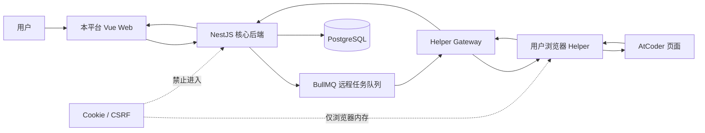
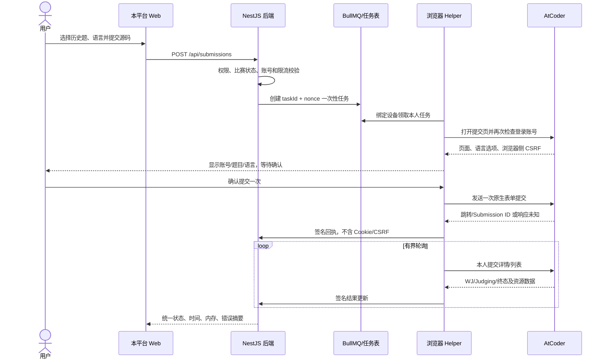
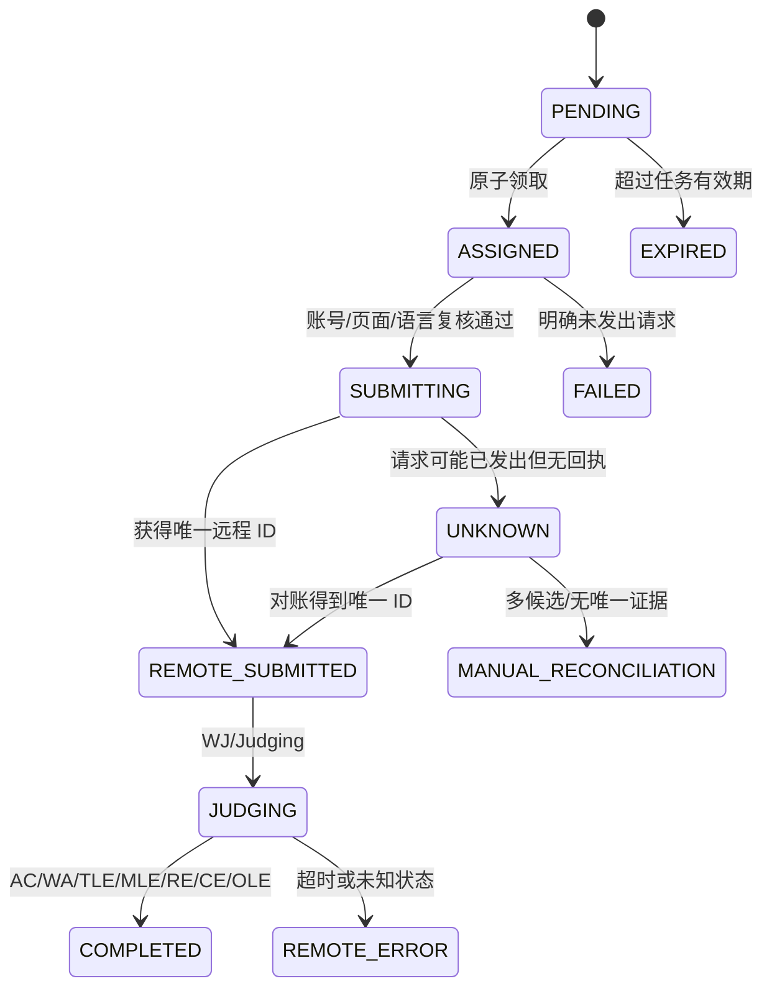

# AtCoder VJudge 接入完整实现方案

## 0. 当前实现状态（2026-07-14）

本方案的轨道一“最小元数据 + 原站跳转”已经在项目中实现，轨道二“账号绑定 + 浏览器代提交 + 结果同步”仍未启用。当前实现包含：

- 严格校验并规范化 `https://atcoder.jp/contests/{contest}/tasks/{task}` URL，拒绝 HTTP、跨域、非任务路径和非标准端口。
- 以不快于 1 请求/2 秒的频率人工触发读取公开页面，仅解析标题、时间限制、内存限制和远程标识；响应大小、超时和页面字段均采用失败关闭策略。
- 在 `ProblemSource` 保存 contest、task、题号、元数据哈希、能力摘要和同步状态，不保存完整题面、Cookie、CSRF、密码或 AtCoder 会话。
- 管理端提供单题导入、只读平台状态和 Kill Switch；题目详情只展示最小元数据与 AtCoder 原题入口。
- `ExternalPlatform.readOnly=true`、`allowAutoSubmit=false`，且 `SubmissionService` 对 AtCoder 提交做后端硬拦截。
- 使用脱敏 HTML fixture 覆盖 URL、英日文限制字段、页面变化和状态映射测试；未知状态返回空映射，由上层停止解析。

更新现有数据库需要在 `packages/backend` 执行 `npx prisma db push` 和 `npx prisma generate`。当前实现没有对 AtCoder 发起登录、提交、本人提交列表读取或真实 PoC；这些内容仍受本文授权前置条件约束。

## 文档信息

| 项目 | 内容 |
| --- | --- |
| 平台 | AtCoder，`https://atcoder.jp` |
| 负责人 | 李袖宗 |
| 文档版本 | v1.0 |
| 首次完成日期 | 2026-07-14 |
| 最后核验日期 | 2026-07-14 |
| 适用项目版本/提交 | `swufe.OJ`，Git commit `589b1d8` |
| 接入成熟度 | 调研完成，待合规确认与 PoC |
| 核验账号 | 负责人已完成个人账号注册并在本人浏览器登录；本文未采集账号名、密码、Cookie、Token 或 CSRF 值 |

本文所称 VJudge 是“本平台创建任务，由用户浏览器 Helper 使用用户本人已经登录的 AtCoder 会话完成一次远程提交，再把不含凭证的远程回执和评测结果同步到本平台”。AtCoder 未提供经本文核验可用于代码提交的正式开放 API，因此不得把本方案称为“AtCoder 官方 Remote Judge API”。文中“页面观察”表示 2026-07-14 对公开页面或未登录行为的实际观察；“项目建议值”不是 AtCoder 官方限流数字；“待平台授权确认”表示上线前必须获得 AtCoder 明确许可或法律意见。

## 1. 结论摘要（必填）

| 能力 | 是否可做 | 推荐实现 | 稳定性 | 是否需平台授权 | 主要风险 |
| --- | --- | --- | --- | --- | --- |
| 账号身份验证 | 有条件可做 | Helper 在浏览器侧识别当前登录用户并与绑定名比较 | 中 | 灰度前建议确认 | 页面结构变化、用户改名、会话过期 |
| 题目元数据同步 | 有条件可做 | 低频读取比赛任务列表和题目公开页，仅保存最小元数据 | 中 | 批量同步及商用需确认 | 版权、429、双语 DOM 变化 |
| 题面同步/展示 | 暂不建议完整复制 | 默认只展示标题、限制、来源和原题链接 | 高（跳转）/低（复制） | 是 | 题面、图片和公式版权不明 |
| 提交代码 | 技术上可做 | 用户浏览器 Helper 打开提交页，用户确认后提交一次 | 低到中 | 是 | 无公开提交 API、CSRF、风控、页面变化 |
| 获取远程提交 ID | 有条件可做 | 首选提交响应/跳转 URL，备选本人提交列表严格差分 | 中 | 是 | 网络超时、并发串单、手工提交干扰 |
| 查询评测状态 | 有条件可做 | Helper 读取提交详情或本人提交列表，保留原始状态 | 中 | 是 | 页面登录要求、WJ/Judging 长时间停留 |
| 同步时间/内存/分数 | 有条件可做 | 从提交详情/列表读取并按单位转换 | 中 | 是 | 非所有状态均有数值、字段结构变化 |

**唯一推荐级别：`B：用户浏览器辅助，可灰度使用`。** 该级别只适用于已经结束的公开比赛题、普通练习题和用户本人账号，且必须先进行平台授权确认。若未取得授权，生产策略自动降为 `C：仅元数据同步和原站跳转`。

技术上，AtCoder 的比赛、任务和题目采用可解析的稳定 URL 形态；登录后的提交页面必然需要任务、语言、源代码、浏览器会话和 CSRF 等字段；提交后可通过远程 Submission ID 关联结果。页面观察表明，未登录访问提交页或提交记录会跳转到 `/login?continue=...`，这也证明提交动作应留在用户浏览器，而不是让服务器保存第三方凭证。

合规上，AtCoder《Terms of Use》要求每个自然人原则上只能持有一个账号，禁止共享登录 ID，并保留对其认为不适当行为处置的权利。[R1] 条款没有给本项目自动提交、批量抓取或题面转载的明确授权。故“网页可访问”不能推导为“允许生产自动化”。本项目需要向 AtCoder 说明教育用途、访问频率、凭证留在浏览器、历史题限制和停用机制，取得书面确认后才进入灰度。

竞赛公平性是硬边界。正式比赛进行期间，AtCoder 规则禁止泄露题目相关非公开信息，并要求个人独立参赛；ABC 还存在专门的生成式 AI 规则。[R3][R4] 本平台无法证明浏览器辅助提交不会改变比赛行为或违反特定比赛规则，因此所有正在进行的 Rated、正式、企业赛和受限比赛默认返回 `CONTEST_RESTRICTED`。赛后补题也只能在远程比赛明确允许提交、用户主动确认、适配器健康的条件下进行。

## 2. 调研范围与非目标（必填）

### 2.1 本期范围

| 维度 | 本期支持范围 | 判定方式 |
| --- | --- | --- |
| 题目来源 | 已结束的公开 AtCoder 比赛普通题、明确开放的练习比赛题 | 比赛开始/结束时间、公开性、适配器策略共同判定 |
| 题型 | 单文件、标准输入输出；Special Judge 仅同步远程结果 | 题面和比赛规则探针，不在本地复刻判题器 |
| 语言 | C、C++、Java、Python 的远程页面当前可用版本 | 每次从提交页动态读取，不长期硬编码语言 ID |
| 账号 | 用户本人普通 AtCoder 账号 | Helper 识别当前登录账号，和本地绑定一致 |
| 功能 | 最小元数据、原站跳转、人工确认式提交、ID 捕获、结果同步 | 平台开关逐级开放 |
| 比赛状态 | 已结束且允许赛后提交 | 服务端时间与页面时间双重判断 |

### 2.2 明确不做

本期不绕过验证码、Cloudflare、访问频率限制或任何风控；不代用户保存 AtCoder 密码、完整 Cookie、Session、CSRF；不建设共享账号池；不支持同一远程账号并发刷提交；不在正在进行的正式比赛中代交；不自动接受来源不明的远程任务；不复制未获许可的完整题面、图片、样例解释或官方题解；不支持私有比赛、邀请赛、Output Only、多文件附件和交互题；不根据“最新一条提交”草率认领 Submission ID；不在提交结果未知时自动重提。

### 2.3 前置条件

用户必须拥有本人 AtCoder 账号并在受支持浏览器中登录；安装来源可验证、最小权限的 Helper；本平台和 Helper 全链路使用 HTTPS/WSS；后端具备认证、任务签名、一次性 nonce、数据库原子领取、审计、队列和平台级 Kill Switch；浏览器能直接访问 `atcoder.jp`；本地题目记录包含规范化远程 URL；管理员完成 AtCoder 合规确认；扩展版本和后端协议版本兼容。负责人已完成“注册并登录”的人工前置条件，但本文没有读取或记录任何登录秘密。

当前仓库与任务书存在差距：commit `589b1d8` 中没有 `extension/`、`helper.service.ts`、`helper.gateway.ts`、`第三方账号绑定方案.text`、`ExternalPlatform`、`HelperDevice` 或 `RemoteSubmissionTask`。已有 `ExternalAccount` 会保存 `accessToken`/`refreshToken`，与本方案“服务器不保存 AtCoder 凭证”的原则冲突；已有 `RemoteJudgeJob` 也缺少 nonce、设备、租约、未知提交保护和远程账号级串行约束。第 15、16、22 节给出增量改造。

## 3. 官方能力与合规边界（必填）

### 3.1 官方公开能力清单

| 能力/接口 | 官方链接 | 认证方式 | 限流 | 能否商用/转载 | 核验结果 |
| --- | --- | --- | --- | --- | --- |
| 服务条款 | `https://atcoder.jp/tos` | 无 | 未公布 | 以条款为准 | 2026-07-14 可访问；页面标注 2026-06-29 修订 [R1] |
| 隐私政策 | `https://atcoder.jp/privacy` | 无 | 未公布 | 不构成数据再利用授权 | 说明 Cookie、IP、答案和日志等个人数据处理 [R2] |
| 比赛首页 | `/contests/{contest}` | 公开比赛通常无需登录 | 未公布 | 页面可读不等于可批量转载 | 可读取比赛名称、起止时间、Rated Range（页面观察） |
| 任务列表 | `/contests/{contest}/tasks` | 公开且已解锁时无需登录 | 未公布 | 待授权确认 | 可读取题号、题名、时间和内存限制（页面观察） |
| 题目页 | `/contests/{contest}/tasks/{task}` | 公开且已解锁时无需登录 | 未公布 | 完整题面转载待确认 | 有日文/英文区块、公式、样例、时间/内存（页面观察） |
| 比赛规则 | `/contests/{contest}/rules` | 通常无需登录 | 未公布 | 仅作为规则依据 | 包含个人参赛、语言、比赛中信息披露等规则 [R3] |
| FAQ | `https://atcoder.jp/faq` | 无 | 未公布 | 仅作说明引用 | 说明用户名原则上仅可改一次、语言以比赛规则页为准 [R5] |
| 正式代码提交 API | 未找到 | 不适用 | 不适用 | 未获授权 | 官方站点和上述资料未发现公开提交 API；必须标为“无正式开放 API” |
| 正式结果查询 API | 未找到 | 不适用 | 不适用 | 未获授权 | 本方案只能使用页面观察或未来获得授权的接口 |

AtCoder 没有在上述官方资料中公布可供本项目使用的精确请求频率。2026-07-14 调研中，同时访问多个官方页面出现过 HTTP `429 Too Many Requests`，随后单次低频访问恢复；这是“实验观察”，不是官方限流数字。项目参数因此必须保守，并在 429 时立即退避，不能把观察值解释为可用配额。

### 3.2 非公开页面能力

| 页面/行为 | 用途 | 观察方式 | 稳定性 | 变更风险 | 降级方式 |
| --- | --- | --- | --- | --- | --- |
| `/contests/{contest}/submit?taskScreenName={task}` | 选择任务、语言并提交代码 | 未登录请求跳转登录；登录字段待 PoC 脱敏 fixture 核验 [R9] | 低到中 | 表单名、动态字段、JS 行为变化 | 只打开原站提交页，不自动填充 |
| 页面内 `csrf_token` | 防跨站请求 | 公开页也可观察到同名隐藏字段；真实提交值只在浏览器内存使用 | 低 | 名称、生命周期、绑定关系变化 | 停止自动提交，提示刷新原站页 |
| `/contests/{contest}/submissions/me` | 本人提交列表、差分获取 ID | 未登录会跳转登录页 [R10] | 中 | 列表列顺序、分页、可见性变化 | 使用提交响应/跳转；失败则人工对账 |
| `/contests/{contest}/submissions/{id}` | 结果、语言、时间、内存、代码大小 | 需登录行为和可见字段待 PoC 核验 | 中 | 状态 DOM、权限、详情字段变化 | 原站查看，本地标记 `REMOTE_ERROR` |
| 顶部用户入口或 `/users/{name}` | 识别当前登录用户 | 登录后页面观察，需多信号校验 | 中 | 导航结构、显示名与 ID 混淆 | 要求用户在原站确认并重新绑定 |
| 提交后的 302/页面跳转 | 捕获 Submission ID | 待 PoC 通过浏览器网络事件核验 | 中 | 跳转目标变化、响应丢失 | 严格的本人列表差分；仍不确定则人工对账 |

这些路由和字段均属于网页实现细节，不保证兼容。Helper 适配器必须集中管理路由模式、字段名和语义探针，不能在多个 content script 中散落 CSS 选择器；每次发布适配器先用只读 fixture 和人工确认式 PoC 验证。

### 3.3 服务条款与竞赛规则

账号方面，《Terms of Use》写明每个自然人原则上一个账号，不得共同持有账号、转让或出借账号、共享登录 ID。[R1] 因此本项目必须使用用户本人会话，不可建设账号池，也不可允许一个 AtCoder 账号被多个本地用户绑定。用户改名仅按 FAQ 提示重新核验，不将页面显示名当作永久不可变主键。[R5]

自动化访问方面，官方条款未给出抓取、自动提交、Remote Judge 或批量转载的明确许可；同时禁止损害服务或平台认为不适当的行为。[R1] 本方案把生产提交和规模化同步列为“待平台授权确认”。在没有回复前，只允许开发人员以正常人工访问强度做只读研究，不做压力测试。

内容方面，条款说明服务中的文字、图片、程序及其他数据的权利原则上属于 AtCoder 或相应权利人，用户自己创作的程序除外。[R1] 所以本平台不能因页面公开而完整镜像题面。MVP 只保存远程标识、标题、URL、时间/内存、语言能力和必要的来源说明；完整题面默认原站打开。若未来取得转载许可，仍需 HTML 清洗、图片来源控制和版权标记。

竞赛方面，具体比赛规则优先于通用条款。ABC400 规则明确要求个人参赛、禁止多人合谋，禁止比赛中公开题目相关信息，并禁止攻击系统；WJ 可能因预热保持 1 至 2 分钟，超过 5 分钟应通过官方渠道联系。[R3] AtCoder 还对 ABC 的生成式 AI 输入题面设有限制。[R4][R14] 为避免辅助提交改变竞赛合规，本项目不对进行中的比赛创建远程提交任务。

隐私方面，AtCoder 隐私政策将 Cookie、IP、比赛答案、日志和元数据纳入处理范围。[R2] 本平台只处理完成任务所需的最小本地数据；第三方 Cookie/CSRF 永不上传；远程用户名、Submission ID、时间/内存、状态属于审计和功能数据，须在本平台隐私政策中明示用途、保存周期和删除方式。

### 3.4 接入红线

出现以下任一情况立即关闭 AtCoder 自动提交：AtCoder 明确反对或要求停止；条款或比赛规则变化；429、403、验证码或额外身份验证比例异常；登录账号无法可靠识别；提交页面字段探针失败；Submission ID 捕获率低于阈值；结果出现未知状态；同账号发生疑似串单；Helper 上传 Cookie/CSRF；扩展供应链校验失败；远程比赛正在进行或状态不明；题目版权投诉；无法证明请求是否已经发出。关闭后按“人工确认填充 -> 原站提交页 -> 原题页”降级。

## 4. 平台对象与编号规则（必填）

| 对象 | 本地字段 | 远程字段/规则 | 示例 | 是否长期稳定 |
| --- | --- | --- | --- | --- |
| 用户 | `remoteUserId` | AtCoder user screen name；以 `/users/{name}` 中规范化路径为准 | 不记录负责人真实用户名 | 可改一次，需重验 [R5] |
| 题目 | `remoteProblemId` | 组合键 `{contestScreenName}/{taskScreenName}` | `abc400/abc400_a` | 较稳定，仍保留原 URL |
| 比赛 | `remoteContestId` | URL 中 contest screen name | `abc400` | 较稳定 |
| 题号 | `remoteProblemIndex` | 任务表第一列显示序号 | `A` | 只在比赛内有意义 |
| 题目内部路径名 | `remoteTaskScreenName` | `/tasks/` 后的路径段 | `abc400_a` | 较稳定，不等同于题号 |
| 提交 | `remoteSubmissionId` | 提交详情 URL 中十进制数字路径段 | `69450872`（官方规则页公开链接示例） | 稳定但只作为字符串存储 |

规范化规则为：只接受 HTTPS 和精确主机 `atcoder.jp`；删除 `lang`、追踪参数和 fragment；contest/task 路径段只允许小写字母、数字、下划线和连字符；拒绝用户名、contest、task 为空或包含路径穿越字符；`remoteProblemId` 以组合键保存，不能只存 `A` 或只存 `abc400_a`。同一题可能从任务列表、题面、提交页进入，最终都规范化为题面 URL。

如果比赛迁移、题目重命名或原页面 404，不自动把历史提交迁移到相似标题；保留旧键并标记 `REMOTE_NOT_FOUND`，由管理员核验。重题按远程组合键去重，不按标题去重。私有题或未解锁题不得同步。删除题保留历史 Submission 和远程对账信息，只下架 Problem。用户改名时，Helper 重新证明当前用户名；旧名留在审计记录，绑定记录更新需要唯一性事务。本文编号和字段示例来自 ABC400 比赛、任务表和题目页的公开观察。[R6][R7][R8]

## 5. 总体架构与信任边界（必填）



| 组件 | 负责 | 禁止 |
| --- | --- | --- |
| Vue Web | 创建本地 Submission、显示远程来源和状态、提示安装 Helper | 接触 AtCoder Cookie/CSRF、伪造远程结果 |
| NestJS 后端 | 权限、竞赛限制、任务签名、幂等、状态机、审计、结果映射 | 代存 AtCoder 密码或完整 Cookie、直接模拟登录 |
| BullMQ/数据库 | 排队、账号级串行、租约、超时和对账 | 在普通失败时盲目重提 |
| Helper Gateway | 设备注册、心跳、任务推送、签名回执 | 将任务广播给其他用户或其他设备 |
| 浏览器 Helper | 使用当前会话、校验账号、打开提交页、读取动态字段、提交一次、回传脱敏结果 | 上传凭证、绕验证码、领取他人任务 |
| AtCoder | 展示题目、接受提交、远程评测、展示结果 | 不受本平台控制 |

源代码路径为：用户编辑器 -> 本平台 Web -> NestJS -> 加密数据库/一次性任务 -> 绑定用户的 Helper -> AtCoder。源代码是完成远程提交所必需的数据，但只允许任务所属用户、后端调度模块和绑定 Helper 在任务有效期内访问；日志只能记录长度和 SHA-256 摘要前缀，不能记录正文。AtCoder Cookie、Session、真实 CSRF 从浏览器 Cookie Jar/页面进入 Helper 的当前执行上下文，不经过 Web、本平台后端、Redis 或 PostgreSQL。结果由 Helper 从本人页面读取并回传；除非 AtCoder 将来提供正式读取 API并授权，否则后端不直接查询登录页面。

## 6. 账号绑定与归属验证（必填）

1. 用户在本平台填写 AtCoder user screen name；后端执行字符、长度、平台内唯一性检查，但不要求用户提供密码。
2. 后端创建短期 `VERIFY_ACCOUNT` 任务，绑定本地用户、设备、平台、nonce 和过期时间。
3. Helper 打开 `https://atcoder.jp/` 或用户页，在页面同源环境检查是否登录。首选信号是导航中的用户链接和规范化 `/users/{screenName}`；备选信号是需要登录的页面未跳转 `/login`。必须至少两个信号一致。
4. Helper 只回传 `platform=ATCODER`、规范化远程用户名、验证时间、页面探针版本和签名，不回传 Cookie、CSRF、HTML 全文或邮箱。
5. 后端以常量时间字符串比较规范化绑定名与当前登录名，并检查该远程账号未被其他本地用户占用。
6. 匹配后账号状态从 `PENDING_VERIFICATION` 变为 `SUBMISSION_READY`；不匹配转为 `MISMATCH`，禁止领取提交任务。

账号状态统一使用 `PENDING_VERIFICATION`、`VERIFIED`、`SUBMISSION_READY`、`MISMATCH`、`EXPIRED`、`REVOKED`。验证有效期建议 24 小时；每次实际提交前 Helper 再校验一次。AtCoder FAQ 表示用户名原则上可改一次，因此检测到原绑定用户页不存在或当前用户名变化时，不能自动把新名认作同一人，须用户发起重新绑定并保留审计。[R5]

同一远程账号只能绑定一个本地用户；一个本地用户只保留一个有效 AtCoder 绑定。用户注销 AtCoder 或本地账号时撤销设备与绑定。用户在另一设备登录需单独注册 HelperDevice。心跳超过 90 秒、验证超过 24 小时、出现 `/login` 跳转、设备被撤销或扩展版本不兼容时，状态转为 `EXPIRED`，重新验证后才可提交。

## 7. 题目与比赛元数据同步（必填）

### 7.1 数据来源

数据来源分为：AtCoder 官方比赛首页、任务列表、题目页和规则页的公开 HTML。它们是公开页面，不是开放 API。第三方 AtCoder Problems 等数据集不属于 AtCoder 官方能力，本期不作为权威来源；如以后使用，必须单独核验其许可证、更新延迟和字段含义。

### 7.2 字段映射

| 本地字段 | 远程字段/页面位置 | 转换规则 | 缺失时处理 |
| --- | --- | --- | --- |
| `title` | 任务表 Task Name 或题面 H2 | HTML 实体解码、去首尾空白 | 不创建新题，报警 |
| `remoteProblemId` | contest path + task path | `{contest}/{task}` 小写规范化 | 拒绝 |
| `remoteUrl` | 题面 URL | 强制 `https://atcoder.jp`，去查询参数 | 拒绝 |
| `timeLimit` | 任务表 `Time Limit` | 秒转毫秒，例如 `2 sec -> 2000` | 标记待核验，不猜值 |
| `memoryLimit` | 任务表 `Memory Limit` | MiB 转整数 MiB | 标记待核验 |
| `difficulty` | 官方页面无统一公开难度 | 留空；不把第三方估值冒充官方 | `null` |
| `tags` | 官方题面未提供统一标签 | 留空或使用本平台人工标签并标来源 | 空数组 |
| `problemType` | 规则/题面和人工能力检查 | 默认 `STANDARD`，有交互/附件信号则禁用 | `UNKNOWN` 并只跳转 |
| `remoteContestId` | `/contests/{contest}` | 路径段规范化 | 拒绝 |
| `remoteProblemIndex` | 任务表首列 | 保存显示文本，不作为全局 ID | 可为空 |
| `contestStartAt/endAt` | 比赛首页 `<time>` | 解析含时区时间并存 UTC | 状态未知，禁止提交 |
| `ratedRange` | 比赛首页 | 仅展示/风控，不推断用户资格 | 可为空 |

### 7.3 同步算法

首次由管理员输入 contest screen name，系统低频读取比赛首页和任务列表；先规范化 contest，再逐行提取 task、标题、时间和内存，以 `(platform, remoteProblemId)` upsert。增量同步以页面 ETag/Last-Modified（若服务端提供）、内容摘要和 `lastSyncAt` 为游标；比赛结束后 24 小时内最多每 6 小时一次，历史比赛最多每 7 天一次，且只有明确业务需求才访问。

页面 200 但关键语义字段缺失时视为结构变化，不写入空值覆盖旧数据。404 连续两次转 `REMOTE_NOT_FOUND`，不物理删除。429 遵循 `Retry-After`（若有），否则指数退避；403、验证码、CloudFront 拦截立即熔断。HTML 使用成熟解析器按 DOM 结构解析，不用正则拼接业务字段；所有 HTML 先在隔离进程解析并清除 script、event handler、危险 URL。未获题面转载许可时不保存题面正文和图片，只保存最小元数据与原站链接。

### 7.4 题型支持矩阵

| 题型 | 支持 | 原因 | 降级 |
| --- | --- | --- | --- |
| 普通单文件 | 是，历史题灰度 | 与现有编辑器和远程提交模型匹配 | 原站提交 |
| Special Judge | 有条件 | 只同步 AtCoder 最终结果，不复刻 checker | 结果不完整则原站查看 |
| Interactive | 否 | 页面能力判定和结果语义更复杂 | 仅原题跳转 |
| Output Only | 否 | 可能需要文件、特殊格式或人工材料 | 仅原题跳转 |
| 多文件/附件 | 否 | 当前 `Submission.sourceCode` 是单字符串 | 仅原题跳转 |
| 私有题/未解锁题 | 否 | 权限和内容边界不可验证 | 禁止同步和提交 |

## 8. 远程提交完整流程（必填，全文核心）

1. Web 调用本地提交接口。后端验证登录用户、题目可见性、源码长度、语言白名单和提交频率，创建 `Submission(status=PENDING)`。
2. 后端确认 `ProblemSource.platform=ATCODER`，规范化 contest/task；读取比赛起止时间和能力探针。比赛进行中、状态未知、私有题、交互题或适配器关闭时直接失败，绝不创建远程动作。
3. 后端检查 ExternalAccount 为 `SUBMISSION_READY`、HelperDevice 在线、最近验证未过期，并检查该远程账号没有活动任务。
4. 事务中创建 `RemoteSubmissionTask`，生成 128 位随机 nonce、任务签名、5 分钟过期时间和源代码 SHA-256；只把任务分配给当前用户的指定设备。
5. Helper 通过 WSS 领取任务，验签、核对协议版本、设备 ID、本地用户、平台、nonce、过期时间和任务未执行标记；再次识别 AtCoder 当前登录用户。
6. Helper 打开 `/contests/{contest}/submit?taskScreenName={task}`。若跳转 `/login`、出现验证码、维护提示、额外身份验证、403/429 或任务选项不存在，停止并回传分类错误。
7. Helper 从当前页面读取实际表单 action、CSRF 和动态字段。CSRF 只存 JS 执行栈/内存，任务结束立即丢弃；禁止写日志、扩展 storage 或上传后端。
8. Helper 从页面 `<option>` 动态匹配本地语言到远程语言 ID和完整名称，核对任务选项。显示远程题目、账号脱敏名、语言和代码摘要，由用户确认；未知语言在发送前失败。
9. Helper 只发送一次页面原生提交。发送前把本地任务原子标为 `SUBMITTING`；请求一旦可能到达网络层，便标为 `REMOTE_SUBMIT_UNKNOWN` 保护态，除非获得明确远程 ID。
10. 首选从 HTTP 302 `Location`、最终地址或响应内明确的 submission 路径提取十进制 ID；验证域名、contest 和 ID 格式。
11. 如果首选失败但能够访问本人提交列表，按提交前快照与提交后列表差分，联合校验账号、task、语言、时间窗和代码摘要可验证信号。不能唯一匹配则进入人工对账，禁止重提。
12. Helper 回传签名回执：taskId、nonce、remoteSubmissionId、remoteAccount、contest/task、remoteLanguageName、submittedAt、sourceHash、adapterVersion；不含 Cookie、CSRF 和源码。
13. 后端验签并以 compare-and-set 从 `SUBMITTING/UNKNOWN` 进入 `REMOTE_SUBMITTED`；同一 ID 不得绑定不同本地 Submission。
14. Helper 以集中调度读取提交详情/本人列表。短期轮询建议 2、3、5、8、13 秒加抖动，此后 20 至 30 秒；遇 429 按响应退避，不无限刷新。
15. 对 WJ、Judging 等非终态映射为 `JUDGING`；对 AC、WA、TLE、MLE、RE、CE、OLE、IE 等保留 `rawStatus` 并映射统一状态。时间转毫秒，内存按页面单位归一为 KiB 或项目统一单位，缺失保留 null。
16. 终态写入 Submission、RemoteJudgeJob/Task 和审计日志，并通过 WebSocket 或轮询通知 Web。超过 10 分钟未终结则停止高频轮询并进入慢速对账；超过项目上限标记 `REMOTE_ERROR`，但不覆盖远程可能仍在评测的事实。
17. 页面变化、账号错配或远程不可用时，按自动提交关闭、人工确认填充、原站提交页、原题页的顺序降级。



## 9. 页面/API 交互清单（必填）

| 编号 | URL/路由模式 | 方法 | 官方 API | 执行端 | 认证 | 请求关键字段 | 响应关键字段 | 限流/风险 |
| --- | --- | --- | --- | --- | --- | --- | --- | --- |
| AC-01 | `https://atcoder.jp/contests/{contest}` | GET | 否，公开页面 | 后端 | 通常无 | contest、`lang` | 标题、起止时间、Rated Range | 低频；结构变化、429 |
| AC-02 | `/contests/{contest}/tasks` | GET | 否，公开页面 | 后端 | 公开且已解锁时无 | contest、`lang` | index、task、title、time、memory | 低频；版权和 DOM 变化 |
| AC-03 | `/contests/{contest}/tasks/{task}` | GET | 否，公开页面 | 后端或 Helper | 公开且已解锁时无 | contest、task、`lang` | 题面双语区块、限制、样例 | 默认不镜像正文 |
| AC-04 | `/contests/{contest}/rules` | GET | 否，公开页面 | 后端 | 通常无 | contest、`lang` | 规则、语言版本、比赛限制 | 规则优先级高，需缓存 |
| AC-05 | `/contests/{contest}/submit?taskScreenName={task}` | GET | 否，页面实现细节 | Helper | AtCoder 登录会话 | contest、task | 表单 action、任务选项、语言 option、CSRF | 未登录跳 `/login`；变化即停用 |
| AC-06 | 页面实际 form action，当前通常为提交路由 | POST | 否，页面实现细节 | Helper | Cookie + 页面 CSRF，仅浏览器 | task、LanguageId、sourceCode、动态字段 | 302/页面错误/可能未知 | 最多发送一次；验证码不绕过 |
| AC-07 | `/contests/{contest}/submissions/me` | GET | 否，页面实现细节 | Helper | AtCoder 登录会话 | contest、分页/筛选 | 本人提交行、ID、task、language、status | 未登录跳转；差分需串行 |
| AC-08 | `/contests/{contest}/submissions/{id}` | GET | 否，页面实现细节 | Helper | 以页面实际要求为准 | contest、submission ID | 状态、时间、内存、语言、代码大小、编译信息 | 权限/DOM 变化；不回传源码 |
| AC-09 | `https://atcoder.jp/users/{screenName}` | GET | 否，公开页面 | Helper/后端只读 | 通常无 | screenName | 用户公开主页和规范化路径 | 用户可改名；不可作为登录单一证据 |
| AC-10 | `https://atcoder.jp/login?continue=...` | GET | 否，登录页面 | Helper | 用户人工登录 | continue | 登录页/人工验证 | Helper 不填密码、不监听密码 |

后端只访问不需要用户会话的比赛/题目公开页，因为把登录页面放在后端会迫使服务器接触 Cookie。Helper 访问提交、本人列表和详情，因为这些动作应绑定用户本人当前会话。所有 host 必须精确白名单，禁止任务携带任意 URL。端点返回的 HTML 是不可信输入，解析器只取经过 schema 验证的文本和数字。

页面选择器分三层：路由和表单语义（action、name、option value）为主；可访问性标签、表头文本为辅；CSS class 只作最后手段。探针至少检查页面 URL、登录账号、任务 option、语言 option、单个 CSRF、提交按钮和错误容器。任何多义性均返回 `REMOTE_PAGE_CHANGED`，不能“猜一个最像的元素”。

## 10. Submission ID 获取与防串单（必填）

首选路径是拦截 Helper 自己发起的一次提交响应，从同源 302 `Location`、最终 URL 或明确的响应链接中读取 `/contests/{contest}/submissions/{id}`。解析后必须校验主机、contest、十进制 ID、回执时间和当前任务。ID 以字符串保存，避免跨语言整数范围和未来格式变化。

备选路径是提交前记录本人列表的最大已见 ID/行摘要，提交后读取有限页数做集合差分。候选必须同时满足：远程账号与绑定账号一致、contest 和 task 一致、语言完整名称/动态 ID一致、提交时间落在发送前 10 秒至发送后 120 秒窗口、候选 ID 未被其他任务占用；若页面提供代码长度或可在浏览器本地比对源码，则再比较代码字节长度和 SHA-256。Helper 不能把源码或远程页面中的源码上传给后端。

| 竞争条件 | 防护 | 失败状态 |
| --- | --- | --- |
| 同账号两个本平台任务 | 数据库唯一活动锁，账号级并发为 1 | 后来的任务保持 `PENDING` |
| 用户同时在原站手工提交 | 任务确认时提示暂停手工提交；严格多字段差分 | 多候选进入 `MANUAL_RECONCILIATION` |
| 请求超时但远端已收到 | 请求进入网络层即标 `REMOTE_SUBMIT_UNKNOWN` | 禁止重提，列表对账 |
| 页面跳转丢失 | 使用浏览器网络事件和本人列表差分 | 不能唯一匹配则人工处理 |
| Helper 重复回执 | `(taskId, nonce, receiptType, sequence)` 去重 | 重复返回原处理结果 |
| 回执乱序 | 单调 sequence 和状态版本 compare-and-set | 丢弃旧版本并审计 |
| ID 被其他任务占用 | 数据库 `platform + remoteSubmissionId` 唯一约束 | `REMOTE_ID_CONFLICT` 并停用适配器 |

不得只取“最新一条”。若首选和备选得到不同 ID，立即暂停该账号和适配器，保留两组脱敏证据，由管理员在 AtCoder 原站对账。只有明确证明请求未发送，例如表单校验在网络前失败，才允许用户创建新任务；原任务仍保持终态失败，不能复用 nonce。

## 11. 语言映射（必填）

AtCoder FAQ 指向每场比赛的 Rule 页面查看可用语言。[R5] 2026-07-14 对 ABC400 规则页的页面观察显示了当前工具链名称，包括 C23 (GCC 14.2.0)、C++23 (GCC 15.2.0)、Java24 (OpenJDK 24.0.2)、Python (CPython 3.13.7) 等；实际可提交 option 及数值 ID必须在登录后的具体提交页动态获取，不能从规则页名称推测 ID。[R3]

| 本地语言 | 本地版本 | 远程语言 ID/名称 | 远程版本 | 是否启用 | 备注 |
| --- | --- | --- | --- | --- | --- |
| C | `c` | ID：运行时读取；名称优先精确匹配 `C23 (GCC 14.2.0)` | 页面当前版本 | 灰度 | 不匹配时禁用，不回退 C++ |
| C++ | `cpp` | ID：运行时读取；名称优先精确匹配 `C++23 (GCC 15.2.0)` | 页面当前版本 | 灰度 | 管理员可配置允许的 GCC/Clang 变体 |
| Java | `java` | ID：运行时读取；名称优先精确匹配 `Java24 (OpenJDK 24.0.2)` | 页面当前版本 | 灰度 | 本地模板必须为 `public class Main` |
| Python | `python` | ID：运行时读取；名称优先精确匹配 `Python (CPython 3.13.7)` | 页面当前版本 | 灰度 | CPython 与 PyPy 不静默互换 |

语言目录由 `adapterVersion + contest + optionValue + normalizedName` 缓存，TTL 建议 24 小时；真正提交前仍复核 option 存在。配置中心保存匹配规则和启用状态，业务代码不固化数值 ID。名称匹配先全名精确、再使用管理员批准的版本范围规则；出现两个候选、版本大升级、语言被移除或 option value 非预期格式时，提交前失败为 `LANGUAGE_UNSUPPORTED` 并报警。

## 12. 评测状态与结果映射（必填）

| 远程原始状态 | 是否终态 | 本地状态 | 分数规则 | 时间/内存单位 | 备注 |
| --- | --- | --- | --- | --- | --- |
| `WJ` / Waiting for Judging | 否 | `JUDGING` | 暂不更新 | null | 规则页提示初次预热可持续 1-2 分钟 [R3] |
| `WR` / Waiting for Re-judging | 否 | `JUDGING` | 保留旧分数但标记重判中 | null | 页面观察待 fixture 确认 |
| `Judging` 或带进度文本 | 否 | `JUDGING` | 暂不更新 | 已出现字段可暂存但不终结 | 不依赖颜色 class |
| `AC` | 是 | `ACCEPTED` | 普通题 100 或远程显示分数 | 时间转 ms；内存转 KiB | 远程值缺失则 null |
| `WA` | 是 | `WRONG_ANSWER` | 0 或远程显示分数 | 同上 | 保留 rawStatus |
| `TLE` | 是 | `TIME_LIMIT_EXCEEDED` | 0 或远程显示分数 | 同上 | 不用本地限制重新推断 |
| `MLE` | 是 | `MEMORY_LIMIT_EXCEEDED` | 0 或远程显示分数 | 同上 | 页面未给内存则 null |
| `RE` | 是 | `RUNTIME_ERROR` | 0 或远程显示分数 | 同上 | 错误摘要脱敏和限长 |
| `CE` | 是 | `COMPILE_ERROR` | 0 | 通常无执行时间/内存 | 编译信息只给提交所有者 |
| `OLE` | 是 | `OUTPUT_LIMIT_EXCEEDED` | 0 或远程显示分数 | 同上 | 若页面使用不同缩写需新增映射 |
| `PE`（若出现） | 是 | `PRESENTATION_ERROR` | 按远程分数 | 同上 | 未见官方统一说明，待样本确认 |
| `IE` / Judge Error（若出现） | 是 | `SYSTEM_ERROR` | 不推断 | 可为空 | 保留原文并报警 |
| 未识别文本 | 暂按终止本地轮询 | `REMOTE_ERROR` | 不覆盖旧分数 | 原始单位摘要 | 自动熔断，人工新增映射 |

数据库必须保留 `rawStatus`、解析器版本和经脱敏的结果摘要。未知状态不能直接写入 `Submission.status`。结果更新采用终态保护：远程重判是显式事件时才允许从既有终态回到 `JUDGING`；普通迟到回执不能把一个终态覆盖成另一个终态。AtCoder 状态显示文本、title 和语义属性为主信号，颜色 class 只能辅助。

## 13. 任务状态机、幂等与重试（必填）



幂等键为 `taskId + nonce`，提交动作另有 `actionSequence=1` 固定约束。领取任务使用数据库事务 `UPDATE ... WHERE state=PENDING AND leaseExpiresAt IS NULL` 或等价原子操作；Redis 锁只能优化，数据库状态才是事实来源。建立“每个 `(platform, externalAccountId)` 最多一个活动任务”的部分唯一约束或锁表，避免多设备并发。

| 场景 | 是否自动重试 | 理由 |
| --- | --- | --- |
| Helper 未领取且任务未过期 | 可重新推送同一任务 | 尚未执行远程动作 |
| 页面加载网络失败，尚未创建 POST | 有限重试 GET | 可证明提交请求未发出 |
| 语言/任务/CSRF 校验失败 | 否 | 需要页面适配或用户处理 |
| POST 明确被浏览器在发送前阻止 | 可由用户创建新任务 | 原任务失败并使用新 nonce |
| POST 超时、连接断开、跳转丢失 | 禁止重提 | 远端可能已收到 |
| 结果查询失败 | 可有界重试查询 | 不产生新提交 |

回执带 `sequence` 和 `observedAt`。后端只接受合法前驱状态和更高序号；重复回执返回 200 和当前状态；旧回执记录审计但不改变状态；终态之后只接受经授权的 `REJUDGE_STARTED/RESULT_UPDATE`。任务过期不等于远程提交失败：如果已经进入 `SUBMITTING`，过期后仍需对账。

## 14. 轮询、限流、退避与熔断（必填）

AtCoder 官方资料未公布本项目可依赖的精确 API 配额。下表“平台限制”如写“未公布”即不能当作无限制；“项目配置”是保护 AtCoder 和用户账号的保守建议值。2026-07-14 的并发请求出现 429，只作为限流存在的实验依据。

| 操作 | 平台限制 | 项目配置 | 并发 | 超时 | 退避 | 熔断阈值 |
| --- | --- | --- | --- | --- | --- | --- |
| 元数据同步 | 未公布；观察到 429 | 全局平均不快于 1 请求/2 秒；历史比赛 7 天一次 | 全平台 1 | 15 秒 | 2s、5s、15s、60s，尊重 Retry-After | 5 分钟内 2 次 429/403 即暂停 30 分钟 |
| 创建提交 | 未公布 | 每账号串行；用户确认后仅 1 次 | 每账号 1，全平台初始 2 | 页面 20 秒、POST 30 秒 | POST 不自动重试 | 任一验证码/页面探针失败立即关自动提交 |
| 查询结果 | 未公布 | 2/3/5/8/13 秒后转 20-30 秒并加 20% 抖动 | 每账号 1，全平台初始 4 | 15 秒 | 429/5xx 指数退避，最长 5 分钟 | 连续 3 次页面解析失败或未知状态立即熔断 |

401/登录跳转映射 `REMOTE_LOGIN_REQUIRED`；403 可能是权限、风控或 CloudFront 拦截，禁止立即重试；404 先检查 contest/task/id，再有限复核一次；429 按 `Retry-After`，没有则至少 60 秒；5xx 最多三次查询重试；网络超时区分 GET 与 POST；200 但语义字段缺失视作页面变化。熔断器按平台、适配器版本和账号分层，半开时只执行一个只读探针，不用真实提交探活。

## 15. 数据模型改动（必填）

现有 `ProblemSource` 可保留但缺 contest、task、同步摘要和能力字段；`ExternalAccount` 不应为 AtCoder 保存 accessToken/refreshToken；`RemoteJudgeJob` 可作为结果聚合记录，但不足以表示浏览器任务、设备租约和未知提交保护；`VerdictMapping` 基本可用，但缺终态、解析版本和启用状态；`ExternalPlatform`、`HelperDevice`、`RemoteSubmissionTask` 当前不存在，必须增量新增。

```prisma
model ExternalPlatform {
  id                  String   @id @default(cuid())
  code                String   @unique // ATCODER
  displayName         String
  enabled             Boolean  @default(false)
  readOnly            Boolean  @default(true)
  adapterMinVersion   String?
  configJson          Json
  circuitOpenedAt     DateTime?
  createdAt           DateTime @default(now())
  updatedAt           DateTime @updatedAt
}

model HelperDevice {
  id                  String   @id @default(cuid())
  userId              String
  publicKey           String
  protocolVersion     String
  adapterVersion      String
  status              String   @default("ACTIVE")
  lastHeartbeatAt     DateTime?
  revokedAt           DateTime?
  createdAt           DateTime @default(now())

  @@index([userId, status])
  @@index([lastHeartbeatAt])
}

model RemoteSubmissionTask {
  id                  String   @id @default(cuid())
  submissionId        String   @unique
  platform            String
  externalAccountId   String
  helperDeviceId      String?
  contestScreenName   String
  taskScreenName      String
  remoteLanguageId    String?
  remoteLanguageName  String?
  nonceHash           String   @unique
  sourceHash          String
  state               String   @default("PENDING")
  leaseExpiresAt      DateTime?
  expiresAt           DateTime
  actionStartedAt     DateTime?
  remoteSubmissionId  String?
  receiptSequence     Int      @default(0)
  rawStatus           String?
  failureCode         String?
  createdAt           DateTime @default(now())
  updatedAt           DateTime @updatedAt

  @@unique([platform, remoteSubmissionId])
  @@index([externalAccountId, state])
  @@index([state, expiresAt])
  @@index([helperDeviceId, state])
}
```

对现有模型的建议：`ExternalAccount` 新增 `status`、`verifiedAt`、`verificationExpiresAt`、`lastSeenUsername`，并对 AtCoder 强制 token 字段为空；将唯一约束调整为 `(platform, remoteUserId)` 并增加 `(userId, platform)` 唯一约束。`ProblemSource` 新增 `remoteContestId`、`remoteTaskScreenName`、`remoteProblemIndex`、`metadataHash`、`capabilityJson`、`lastErrorCode`，增加 `(platform, remoteProblemId)` 唯一索引。`RemoteJudgeJob` 增加 `taskId`、`rawResultJson`（脱敏）、`parserVersion` 和 `stateVersion`，或在迁移期逐步由 RemoteSubmissionTask 取代。`VerdictMapping` 增加 `isTerminal`、`enabled`、`updatedAt`。

迁移先添加 nullable 字段和新表，回填 ProblemSource 组合键，再加唯一约束；部署顺序为数据库 -> 兼容后端 -> Helper -> 开关灰度。回滚时先关闭平台并停止新任务，保留任务、远程 ID和审计表，不删除对账数据。源代码沿用 Submission 的访问控制，远程任务完成 24 小时后删除任务载荷副本；Submission 源码按学校政策保留，用户删除请求和课程归档策略需可执行。普通运行日志 30 天、审计和对账摘要 180 天为项目建议值。

## 16. 本平台接口与消息协议（必填）

### 16.1 HTTP 接口

| 方法 | 路径 | 调用方 | 权限 | 请求摘要 | 响应摘要 | 幂等规则 |
| --- | --- | --- | --- | --- | --- | --- |
| POST | `/api/external-accounts/atcoder/verify` | Web | 登录用户 | remoteUsername、deviceId | verificationTaskId、expiresAt | `user+platform+username` 短期复用 |
| GET | `/api/external-accounts/atcoder` | Web | 本人 | 无 | 脱敏账号状态、verifiedAt | 只读 |
| DELETE | `/api/external-accounts/atcoder` | Web | 本人 | 二次确认 | revoked | 重复撤销成功 |
| POST | `/api/submissions` | Web | 登录用户 | problemId、language、sourceCode、idempotencyKey | submissionId、status | 用户提供幂等键，内容不同时冲突 |
| GET | `/api/submissions/{id}` | Web | 所有者/授权教师 | id | 统一结果、远程来源摘要 | 只读 |
| POST | `/api/helper/devices/register` | Helper | 登录用户 + 设备证明 | publicKey、protocolVersion、adapterVersion | deviceId、短期令牌 | 公钥唯一 |
| POST | `/api/admin/platforms/atcoder/kill-switch` | 管理端 | 管理员 + 二次认证 | mode、reason | 当前开关状态 | requestId 幂等并审计 |

### 16.2 Helper 消息

```ts
type HelperEnvelope<T> = {
  protocolVersion: "1.0";
  messageId: string;
  type:
    | "REGISTER"
    | "HEARTBEAT"
    | "CLAIM_TASK"
    | "LOGIN_VERIFIED"
    | "SUBMIT_RECEIPT"
    | "FAILURE_RECEIPT"
    | "RESULT_UPDATE"
    | "TASK_CANCELLED";
  deviceId: string;
  taskId?: string;
  nonce?: string;
  sequence: number;
  sentAt: string;
  payload: T;
  signature: string;
};

interface SignedRemoteTask {
  protocolVersion: "1.0";
  taskId: string;
  nonce: string;
  userId: string;
  deviceId: string;
  platform: "ATCODER";
  contestScreenName: string;
  taskScreenName: string;
  localLanguage: "c" | "cpp" | "java" | "python";
  sourceCode: string;
  sourceHash: string;
  expiresAt: string;
  serverSignature: string;
}

interface RemoteSubmissionReceipt {
  remoteSubmissionId: string;
  remoteUsername: string;
  remoteLanguageId: string;
  remoteLanguageName: string;
  submittedAt: string;
  sourceHash: string;
  adapterVersion: string;
}

interface RemoteJudgeResult {
  remoteSubmissionId: string;
  rawStatus: string;
  status: string;
  terminal: boolean;
  score?: number;
  timeMs?: number;
  memoryKiB?: number;
  message?: string;
  observedAt: string;
  parserVersion: string;
}
```

注册只发送设备公钥和版本；心跳发送能力与健康摘要；领取任务必须带设备和用户上下文；登录验证只发送用户名和时间；提交回执不含源码和凭证；失败回执使用第 19 节错误码；结果更新必须引用已绑定的远程 ID；取消仅在远程 POST 尚未开始时有效。服务端和 Helper 都做 JSON schema 校验并拒绝额外字段，消息正文设长度上限。

### 16.3 签名与防重放

设备注册后取得 15 分钟短期访问令牌；长期身份使用设备非导出私钥签名。服务端对任务正文做规范 JSON 序列化并签名，Helper 验证 `userId/deviceId/platform/expiresAt/sourceHash`。回执签名覆盖 `taskId、nonce、sequence、sentAt、payloadHash`；后端检查时钟偏差不超过 2 分钟、nonce 未消费、设备未撤销和 sequence 单调。服务端签名密钥按 keyId 轮换，旧公钥保留到所有在途任务过期。任何验签失败都不返回敏感差异细节，并触发设备级告警。

## 17. 平台适配器接口（必填）

```ts
interface BrowserJudgeAdapter {
  readonly platform: string;
  detectPage(): boolean;
  detectLogin(): Promise<{
    loggedIn: boolean;
    remoteUserId?: string;
    remoteUsername?: string;
  }>;
  inspectProblem(input: RemoteProblemRef): Promise<ProblemCapability>;
  getLanguageOptions(input: RemoteProblemRef): Promise<RemoteLanguage[]>;
  submit(task: SignedRemoteTask): Promise<RemoteSubmissionReceipt>;
  queryResult(ref: RemoteSubmissionRef): Promise<RemoteJudgeResult>;
  healthCheck(): Promise<AdapterHealth>;
}
```

AtCoder 的 `detectPage`、`detectLogin`、`getLanguageOptions`、`submit` 和需要登录的 `queryResult` 由浏览器实现，因为它们依赖当前页面和用户会话。`inspectProblem` 可拆成后端公开页面能力检查与 Helper 提交前复核。后端实现 URL 规范化、比赛时间限制、结果映射、任务签名和元数据低频同步，不实现 AtCoder 登录。`healthCheck` 只做只读公开页/fixture 探针；禁止用真实提交当健康检查。

建议 `AtCoderBrowserAdapter` 内部分离 `AtCoderRoutes`、`AtCoderPageProbe`、`AtCoderLanguageResolver`、`AtCoderReceiptResolver`、`AtCoderResultParser` 和 `AtCoderErrorClassifier`。这样页面变化时可以单独停用提交解析器，而保留原题跳转。适配器输出严格领域对象，不把任意 DOM、HTML 或远端脚本对象传给后端。

## 18. 安全与隐私（必填）

| 威胁 | 主要控制 | 检测/处置 |
| --- | --- | --- |
| 伪造 Helper | 设备公钥、短期令牌、版本约束、签名 | 验签失败撤销设备并告警 |
| 任务窃取 | 任务绑定 userId/deviceId、原子领取、短租约 | 异常设备领取即冻结账号任务 |
| 重复提交 | actionSequence=1、账号级锁、UNKNOWN 保护 | 重复 POST 意图触发 Kill Switch |
| 恶意题面 | 不信任 HTML、隔离解析、严格清洗、默认原站展示 | CSP 报告和解析失败熔断 |
| 账号串用 | 提交前双信号登录校验、远程账号唯一绑定 | mismatch 立即停止并审计 |
| 回执篡改/重放 | 双向签名、nonce、时间戳、单调 sequence | 拒绝并撤销设备 |
| 日志泄密 | 字段白名单、源码/凭证过滤、错误限长 | DLP 扫描和日志抽样审计 |
| 扩展供应链风险 | 固定发布渠道、包签名、最小权限、可回滚版本 | 版本分布告警和强制停用 |

扩展权限仅允许 `https://atcoder.jp/*` 和本平台 API/WSS，不申请 `<all_urls>`；优先使用用户主动点击触发，避免长期后台扫描。Cookie API 若不是实现所必需则不申请，直接在同源页面使用浏览器现有会话；任何情况下都禁止读取后上传完整 Cookie。CSRF 只用于当前页面当前动作，生命周期不超过一次提交。

后端以 TLS、RBAC、资源所有权、字段加密和审计保护远程用户名、Submission ID和源代码。数据库备份加密；密钥不进代码库；管理端不能查看用户密码或 AtCoder Cookie；教师仅在教学授权范围内查看源码。日志记录 taskId、状态、耗时、错误码、适配器版本和哈希摘要，不记录源码、表单正文、完整 HTML、Cookie、CSRF、Authorization 或个人邮箱。

内容安全方面，本平台不直接执行题面脚本；允许的 Markdown/HTML 标签和 URL scheme 使用白名单，外链图片默认不代理。Helper content script 使用隔离世界，和页面脚本通信的数据必须 schema 校验；不得 `eval` 远程内容。扩展 CSP 禁止远程代码和内联动态脚本。设备可在 Web 端一键撤销，撤销后所有租约和短期令牌失效。

隐私告知应说明：源代码会被发送到 AtCoder；远程用户名和提交结果会回传本平台；Cookie/CSRF 不会离开浏览器；数据保存周期和删除入口；AtCoder 作为独立第三方按其隐私政策处理数据。[R2] 用户必须在首次绑定和首次提交前分别同意，不能把安装扩展视为永久同意。

## 19. 异常分类与降级（必填）

| 失败码 | 含义 | 是否重试 | 用户提示 | 系统动作 |
| --- | --- | --- | --- | --- |
| `HELPER_OFFLINE` | 绑定 Helper 无心跳 | 否 | 打开浏览器并确认扩展在线 | 不创建远程动作，保留本地提交草稿 |
| `REMOTE_LOGIN_REQUIRED` | AtCoder 未登录或会话过期 | 否 | 请在 AtCoder 原站登录后重新验证 | 账号转 `EXPIRED` |
| `REMOTE_ACCOUNT_MISMATCH` | 当前登录账号与绑定账号不同 | 否 | 切换到已绑定账号 | 立即停止、释放任务并审计 |
| `CAPTCHA_REQUIRED` | 出现验证码或额外人工验证 | 否 | 请在原站人工处理 | 自动提交熔断，不提供绕过 |
| `CONTEST_RESTRICTED` | 比赛进行中、状态未知或规则禁止 | 否 | 当前比赛不支持辅助提交 | 拒绝任务，只提供原站链接 |
| `PROBLEM_UNSUPPORTED` | 交互、附件、私有等题型 | 否 | 该题仅支持原站完成 | 记录能力原因 |
| `LANGUAGE_UNSUPPORTED` | 远程无唯一语言映射 | 否 | 请选择 AtCoder 当前支持的语言 | 刷新语言目录并报警 |
| `REMOTE_RATE_LIMITED` | 远端返回 429 | 是，延迟查询 | 请求过于频繁，稍后更新 | 尊重 Retry-After、平台级退避 |
| `REMOTE_FORBIDDEN` | 403、CloudFront 或权限阻止 | 否，人工核验 | AtCoder 暂时拒绝访问 | 账号/平台熔断 |
| `REMOTE_PAGE_CHANGED` | 关键表单或结果结构变化 | 否 | 自动模式暂停，请前往原站 | 关闭对应适配器版本 |
| `REMOTE_SUBMIT_UNKNOWN` | 不确定远端是否收到 POST | 禁止重提 | 正在对账，请勿再次提交 | 进入 UNKNOWN/人工对账 |
| `REMOTE_ID_CONFLICT` | ID 已绑定其他本地任务 | 否 | 结果同步异常，等待管理员处理 | 全平台 Kill Switch |
| `REMOTE_STATUS_UNKNOWN` | 新的远程状态无法映射 | 否 | 结果需人工确认 | 保留 rawStatus、停止终态覆盖 |
| `REMOTE_UNAVAILABLE` | 5xx、维护或网络不可达 | 是，有限查询 | AtCoder 暂不可用 | 有界退避，不重发提交 |
| `TASK_EXPIRED` | 一次性任务过期且未执行 | 否 | 请重新发起 | 旧 nonce 作废 |
| `SIGNATURE_INVALID` | 任务或回执验签失败 | 否 | 设备验证失败 | 撤销设备、记录安全告警 |

降级顺序统一为：自动提交 -> Helper 打开提交页并填充、用户人工复核和确认 -> 只打开原站提交页并由用户自行粘贴 -> 只打开原题页。处于 `REMOTE_SUBMIT_UNKNOWN` 时不得执行“填充后再次确认”，因为第二次提交可能重复；此时只能打开本人提交列表协助对账。

错误展示不暴露内部选择器、签名差异、Cookie 名称、CSRF 或完整远端 HTML。用户看到可行动的中文提示和远程原站入口；管理员看到 taskId、错误码、适配器/解析器版本、状态时间线和脱敏摘要。

## 20. 可观测性与运维（必填）

| 类别 | 指标/日志 | 建议告警 |
| --- | --- | --- |
| 任务 | `remote_task_wait_seconds`、PENDING/ASSIGNED/UNKNOWN 数量 | P95 等待超过 60 秒；UNKNOWN 非零超过 5 分钟 |
| 提交 | 提交页探针成功率、用户确认率、远程 POST 次数 | 单任务 POST 次数大于 1 立即严重告警 |
| ID | `remote_submission_id_capture_rate`、首选/备选比例、冲突数 | 15 分钟窗口捕获率低于 98%；任一冲突 |
| 结果 | WJ/Judging 时长、终态同步率、未知状态数 | 终态同步率低于 99%；未知状态任一出现 |
| 账号 | 登录失效率、账号错配率、验证过期率 | 错配任一；登录失败突增 3 倍 |
| 远端 | 429/403/404/5xx、页面探针失败率 | 5 分钟内 2 次 429/403；关键探针失败任一 |
| Helper | 在线设备数、协议/适配器版本分布、签名失败 | 旧版本超过灰度期限；签名失败任一 |
| 隐私 | 日志敏感字段扫描、源码/凭证命中数 | 命中 Cookie、CSRF、密码或源码正文立即处置 |

结构化日志字段限定为 `traceId、taskId、submissionId、platform、stateFrom、stateTo、errorCode、durationMs、httpClass、adapterVersion、parserVersion、deviceIdHash`。远程用户名和 IP 只在严格授权的审计表中保存或哈希，普通日志不记录。不得记录 URL 中可能出现的 continue 全量参数、POST body 和页面 HTML。

平台配置至少有 `enabled`、`readOnly`、`allowAutoSubmit`、`requireUserConfirmation`、`allowedContestStates`、`globalConcurrency`、`perAccountConcurrency`、`pollSchedule`、`adapterMinVersion` 和 `killSwitchReason`。运维操作顺序为：将 `allowAutoSubmit=false` 停止新 POST；等待在途任务完成或转人工对账；必要时 `enabled=false` 只保留历史查询；回滚 Helper 版本；最后才回滚后端。Kill Switch 必须在 1 分钟内生效并留下操作者、原因和时间。

灰度建议从项目成员本人历史题开始，1 个账号、每日不超过 3 次人工确认提交；连续 7 天没有重复提交、错配、未知 ID和页面探针失败后，才扩到 5 个内部账号。任何验证码或 AtCoder 反馈立即退回只读模式。

## 21. 测试方案（必填）

### 21.1 单元测试

覆盖 URL 规范化（合法/跨域/路径穿越/大小写）、contest/task/Submission ID 解析、动态语言匹配、多候选拒绝、状态映射、时间/内存单位转换、HTML fixture 双语区块、登录跳转识别、验证码/429/403 分类、任务状态合法前驱、签名验签、nonce 防重放、回执乱序、终态保护和日志脱敏。每个页面解析器至少保存成功、字段缺失、额外列、语言改名和未知状态 fixture。

### 21.2 集成测试

集成环境使用专用测试用户和已经结束的普通题，不使用共享账号、不测试正式比赛、不做并发压测。用 Mock AtCoder server 覆盖 302 获取 ID、列表差分唯一匹配、多候选、POST 超时但远端已收、WJ -> AC、WJ -> WA/CE/TLE/MLE/RE/OLE、重判、429 Retry-After、403、维护页和 CSRF 失效。真实 AtCoder PoC 仅在获得授权或确认允许后执行，每个用例人工触发一次。

### 21.3 契约/页面探针

公开页面 fixture 应删除 CSRF 值、用户名、源码、Cookie、IP 和不必要正文，只保留 DOM 结构和假数据。每日探针最多读取一个固定历史比赛首页、任务列表和题目页，校验路由、时间/内存和任务链接；登录/提交页探针由内部用户主动打开时执行，不后台频繁访问。探针失败自动切换 `readOnly=true`，不尝试绕过风控。

### 21.4 端到端验收用例

| 编号 | 前置条件 | 操作 | 预期远程结果 | 预期本地结果 | 证据 |
| --- | --- | --- | --- | --- | --- |
| E2E-01 | 本人账号已注册登录 | Helper 验证绑定 | 不产生提交 | `SUBMISSION_READY`，无 Cookie 入库 | 负责人已确认登录；绑定协议待实现 |
| E2E-02 | 未登录浏览器 | 打开提交任务 | 跳转登录页 | `REMOTE_LOGIN_REQUIRED` | 2026-07-14 页面观察：`/submit` 跳 `/login?continue=...` |
| E2E-03 | 已结束公开比赛 | 同步 ABC400 任务表 | 不产生提交 | 解析 A-G、time、memory | 公开页只读核验 [R6] |
| E2E-04 | 当前时间处于比赛区间 | 尝试创建任务 | 不访问提交 POST | `CONTEST_RESTRICTED` | Mock 时钟自动化测试 |
| E2E-05 | 历史题、C++、账号一致 | 用户确认一次正确代码 | 远程 AC | 唯一 ID、`ACCEPTED` | 待授权后的真实 PoC，不在本文伪造 |
| E2E-06 | 历史题、错误代码 | 用户确认一次 | WA/CE 之一 | 正确状态映射和 rawStatus | Mock 必测，真实 PoC 待授权 |
| E2E-07 | POST 后断网 | 模拟响应丢失 | 可能已创建远程提交 | `REMOTE_SUBMIT_UNKNOWN`，不重提 | Mock 网络故障测试 |
| E2E-08 | 用户同时手工提交同题 | 执行列表差分 | 出现两个候选 | 人工对账，不认领最新一条 | Mock 两候选 fixture |
| E2E-09 | 页面出现验证码/403 | 领取任务 | 不自动处理 | 熔断并降级原站 | Mock 页面 + 真实观察仅记录错误码 |
| E2E-10 | 未知状态文本 | 查询结果 | 保留远程显示 | `REMOTE_ERROR`、报警、不覆盖终态 | 未知状态 fixture |
| E2E-11 | 重复发送同一回执 | 回放消息 | 远端无新动作 | 返回已有状态，审计重复 | 协议集成测试 |
| E2E-12 | 当前账号与绑定名不同 | 提交前校验 | 不发 POST | `REMOTE_ACCOUNT_MISMATCH` | 双账号 Mock；真实测试不得共享账号 |

本文完成的是调研和可开发方案，不把“已登录”冒充“已完成远程提交”。在 AtCoder 未明确授权且项目 Helper 尚不存在的当前仓库上，执行真实自动 POST 会越过本任务的合规和实现前置条件，所以 E2E-05/06 的真实证据被明确列为 PoC 退出条件。

## 22. 项目落地文件清单（必填）

| 路径 | 新增/修改 | 主要内容 | 依赖 | 测试文件 |
| --- | --- | --- | --- | --- |
| `docs/vjudge-platforms/03-atcoder.md` | 新增 | 本文档 | 无 | 文档检查脚本 |
| `packages/backend/prisma/schema.prisma` | 修改 | 平台、设备、浏览器任务、现有模型增量字段 | Prisma Migration | `prisma/*.spec.ts` 或迁移验收 |
| `packages/backend/src/helper/helper.module.ts` | 新增 | Helper 模块装配 | NestJS、WebSocket | `helper.module.spec.ts` |
| `packages/backend/src/helper/helper.gateway.ts` | 新增 | 设备认证、心跳、任务推送、签名回执 | Socket.IO、JWT | `helper.gateway.spec.ts` |
| `packages/backend/src/helper/helper.service.ts` | 新增 | 原子领取、租约、状态机、防重放 | Prisma、Redis | `helper.service.spec.ts` |
| `packages/backend/src/external-account/*` | 新增 | AtCoder 绑定、撤销、重新验证 | HelperService | `external-account.service.spec.ts` |
| `packages/backend/src/remote-judge/remote-judge.service.ts` | 新增 | 平台开关、任务创建、账号级串行、结果聚合 | BullMQ、Prisma | `remote-judge.service.spec.ts` |
| `packages/backend/src/remote-judge/atcoder-metadata.service.ts` | 新增 | 公开页低频元数据同步 | HTML parser | `fixtures/atcoder/*.html` |
| `packages/backend/src/submission/submission.service.ts` | 修改 | 外部题由当前直接 `REMOTE_ERROR` 改为安全任务链路 | RemoteJudgeService | `submission.service.spec.ts` |
| `packages/backend/src/submission/submission.controller.ts` | 修改 | DTO、幂等键、权限和远程状态输出 | class-validator | `submission.controller.spec.ts` |
| `packages/frontend/src/views/ProblemDetail.vue` | 修改 | Helper 状态、远程来源、比赛限制、人工确认 | Pinia/API | `ProblemDetail.spec.ts` |
| `packages/frontend/src/views/Profile.vue` | 修改 | AtCoder 绑定和设备撤销 | External Account API | `Profile.spec.ts` |
| `packages/frontend/src/stores/helper.ts` | 新增 | Helper 在线状态和协议版本 | browser messaging | `helper.spec.ts` |
| `extension/manifest.json` | 新增 | 最小 host 权限、CSP、版本 | Chromium MV3 | manifest 校验 |
| `extension/shared.ts` | 新增 | 消息 schema、签名、脱敏工具 | Web Crypto | `shared.spec.ts` |
| `extension/atcoder-adapter.ts` | 新增 | 登录、语言、提交、ID、结果解析 | 同源页面 | `atcoder-adapter.spec.ts` |
| `extension/bg.ts` | 新增 | 设备通道、任务路由、短期内存状态 | WebSocket | `bg.spec.ts` |
| `extension/fixtures/atcoder/*` | 新增 | 脱敏页面契约样本 | 无 | 解析器测试数据 |

当前演示代码需同步清理：`SubmissionService` 对外部题先写 `REMOTE_ERROR` 却仍返回 `QUEUING`，接口状态不一致；README 将阶段 1、洛谷 Remote Judge 和账号池描述为已完成/计划能力，必须按真实实现修订；`ExternalAccount.accessToken/refreshToken` 不得用于 AtCoder；前端把 access/refresh token 存在 `localStorage`，生产应按项目安全计划迁移；README 和管理页面存在硬编码演示密码，不能进入生产；新 Helper API 不得沿用任何硬编码 userId、设备 ID、远程账号或服务器地址。[R11][R12][R13]

仓库当前没有任务书要求预读的 Helper/extension/第三方账号绑定文件，因此上述文件均标为“新增”，不能在本文中声称已有可复用实现。后端现有 NestJS、Prisma、BullMQ、Submission/Problem 模型是可复用基线。

## 23. 实施阶段与工作量（必填）

| 阶段 | 人日 | 依赖 | 产物 | 退出条件 |
| --- | ---: | --- | --- | --- |
| 1. 合规确认与只读调研 | 2 | AtCoder 回复、学校隐私/版权意见 | 授权记录、红线、来源清单 | 明确允许范围；否则确定只跳转 |
| 2. Adapter 接口与 fixture 单测 | 3 | 脱敏公开页样本 | URL/元数据/状态解析器 | 核心 fixture 测试全通过 |
| 3. 账号绑定和 Helper 登录验证 | 4 | 设备协议、扩展骨架、数据库迁移 | 设备注册、心跳、绑定/撤销 | 无凭证上传，错配稳定拦截 |
| 4. 历史普通题人工确认式提交 PoC | 4 | 平台许可、测试账号、Kill Switch | 动态语言、CSRF 生命周期、单次 POST | 10 次人工 PoC 无重复/串号 |
| 5. Submission ID 与结果同步 | 4 | 提交 PoC、结果 fixture | 首选/差分 ID、状态映射 | ID 捕获率 100%（小样本），终态一致 |
| 6. 安全、幂等、限流、监控和降级 | 5 | 前述链路 | 签名、nonce、锁、熔断、仪表盘 | 故障注入和安全用例通过 |
| 7. 内部灰度 | 5 个日历日/约 2 人日 | 授权、监控、成员账号 | 灰度报告和问题清单 | 7 天无红线事件，指标达标 |
| 8. 生产启用或维持原站跳转 | 1 | 验收和管理决策 | 上线记录或只读决策 | 负责人、管理员和合规方签字 |

总开发量约 25 人日，不含等待 AtCoder 回复和学校合规审批。若授权只允许元数据或原站跳转，则停止第 3-7 阶段的自动提交部分，保留低频元数据、统一 URL 和本地题单能力；不能为了赶进度跳过授权、幂等和 UNKNOWN 对账。

## 24. 上线、回滚与验收标准（必填）

### 24.1 上线前检查

- [ ] 已保存 AtCoder 对自动提交、结果读取和元数据使用范围的明确答复；没有答复则 `allowAutoSubmit=false`。
- [ ] 已复核最新 Terms of Use、Privacy Policy、目标比赛规则和生成式 AI 规则。
- [ ] 数据库迁移在副本环境完成，唯一索引、过期任务索引和回滚脚本验证通过。
- [ ] AtCoder ExternalAccount 的 token 字段始终为空，日志扫描没有 Cookie/CSRF/源码正文。
- [ ] 扩展只申请 `atcoder.jp` 和本平台域名，包签名、CSP、发布渠道和强制最低版本就绪。
- [ ] 账号绑定、错配、设备撤销、会话过期和多设备用例通过。
- [ ] 正在进行的比赛、状态未知比赛、私有题和不支持题型稳定拦截。
- [ ] POST 最多一次、UNKNOWN 禁止重提、远程 ID 唯一约束和回执乱序测试通过。
- [ ] 429/403/验证码/页面变化熔断与四级降级路径通过。
- [ ] 指标、日志、告警、值班联系人和 1 分钟 Kill Switch 可用。
- [ ] 用户告知说明源代码发送给 AtCoder、结果回传和数据删除方式。
- [ ] 真实 PoC 仅使用历史普通题，未对远端做压力测试。

### 24.2 回滚

回滚第一步把 `allowAutoSubmit` 关闭，使新任务不进入 ASSIGNED；PENDING 任务转 `CANCELLED` 并提示原站跳转。已经取得远程 ID 的任务继续低频查询或由用户原站确认；处于 SUBMITTING/UNKNOWN 的任务不能取消后重提，必须保留对账。然后强制 Helper 降到只读版本，撤回有问题的适配器版本，最后回滚后端和数据库兼容代码。

回滚不得删除 RemoteSubmissionTask、RemoteJudgeJob、Submission ID、状态时间线和审计证据。数据库迁移采用向前兼容：旧字段保留至少一个发布周期，新代码停止写入后再清理。若出现凭证泄漏迹象，立即撤销所有 Helper 设备令牌、通知受影响用户在 AtCoder 注销会话/修改密码，并按学校安全事件流程处理；本项目无法代替用户修改 AtCoder 凭证。

### 24.3 验收标准

| 编号 | 标准 | 通过条件 |
| --- | --- | --- |
| A-01 | 账号匹配 | 当前 AtCoder 用户与绑定名一致才可进入 SUBMITTING |
| A-02 | 服务器无第三方凭证 | 数据库、Redis、日志和网络回执均无 Cookie/CSRF/密码 |
| A-03 | 任务只执行一次 | 故障注入和重复消息下，每个 task 的远程 POST 次数不超过 1 |
| A-04 | 正确远程 ID | ID 与账号、contest、task、语言、时间窗唯一对应 |
| A-05 | 状态映射 | AC/WA/TLE/MLE/RE/CE/OLE/WJ/未知状态符合第 12 节 |
| A-06 | 异常不重复提交 | 超时和断网进入 UNKNOWN/对账，不生成第二次 POST |
| A-07 | 风控停止 | 验证码、403、429 和页面变化触发对应降级/熔断 |
| A-08 | 正式比赛限制 | 进行中或状态未知比赛 100% 拦截 |
| A-09 | 可单独关闭 | AtCoder 适配器可在 1 分钟内关闭，不影响本地判题 |
| A-10 | 审计可追溯 | 能从本地 Submission 追到 task、设备、远程 ID和状态时间线 |
| A-11 | 版权边界 | 未授权时不保存完整题面/图片/官方题解 |
| A-12 | 降级可用 | 用户始终至少能打开规范化原题 URL |

## 25. 风险、待确认项与最终建议（必填）

| 风险 | 概率 | 影响 | 当前措施 | 上线前待确认 |
| --- | --- | --- | --- | --- |
| AtCoder 不允许自动提交 | 中 | 极高 | 默认关闭自动提交，先联系官方 | 书面允许的用途、规模和终止条件 |
| 页面结构/语言 ID变化 | 高 | 高 | 动态探测、fixture、语义探针、版本熔断 | 登录后提交页字段和跳转样本 |
| 429/403/风控 | 中 | 高 | 全局低并发、退避、只读半开 | 官方推荐访问频率是否存在 |
| 比赛公平性违规 | 低（有硬拦截时） | 极高 | 所有进行中和未知状态比赛禁用 | 各类比赛赛后提交政策 |
| 题面版权投诉 | 中 | 高 | 默认最小元数据 + 原站链接 | 标题、限制、样例和正文的授权边界 |
| Submission ID 串单 | 中 | 极高 | 账号串行、多字段校验、唯一索引 | 实际 302/列表字段是否足够唯一 |
| 用户会话或源码泄漏 | 低（按方案实现） | 极高 | 凭证浏览器内、签名、日志白名单 | 扩展安全评审和渗透测试 |
| 用户改名/注销 | 低 | 中 | 重新绑定、审计旧名 | 改名后的旧 URL/公开标识行为 |
| WJ/重判导致结果变化 | 中 | 中 | rawStatus、状态版本、显式重判 | 详情页重判信号 fixture |
| 当前项目骨架与文档不一致 | 高 | 高 | 第 22 节列出具体增量文件 | 团队是否优先建设 Helper 基础设施 |

待平台确认问题应一次性发送给 AtCoder：教育项目是否允许用户本人浏览器在人工确认后提交历史题；是否允许低频读取公开比赛/任务元数据；是否允许解析本人提交页同步状态；推荐请求频率；允许保存哪些最小字段；必须使用的标识或 User-Agent；平台要求的停用/通知机制。回复存入项目合规档案并关联文档版本。

最终建议是分两条轨道推进。轨道一立即可做：规范化 AtCoder URL、保存最小元数据、原站跳转、适配器接口、fixture 单测、平台开关和合规联系。轨道二必须等待：账号绑定、登录页解析、动态表单提交、本人结果同步和真实 PoC。只有轨道二获得明确许可并通过安全验收，成熟度才从“调研”升为“可灰度”。

若团队无法在实训周期内取得授权，交付结论不应写“失败”，而应写：AtCoder 已完成 B 级技术方案设计，生产暂按 C 级“元数据 + 原站跳转”落地。这比把页面内部请求冒充官方 API更符合项目质量、竞赛公平和可持续维护要求。

## 26. 参考资料（必填）

所有链接最后核验于 2026-07-14。AtCoder 页面可能更新，实施前需重新核验页面版本和目标比赛的具体规则。

| 编号 | 来源 | 类型 | 本文用途 | 核验说明 |
| --- | --- | --- | --- | --- |
| R1 | [AtCoder Terms of Use](https://atcoder.jp/tos?lang=en) | 官方条款 | 账号、知识产权、禁止事项、条款优先级 | 页面标注 2026-06-29 修订 |
| R2 | [AtCoder Privacy Policy](https://atcoder.jp/privacy?lang=en) | 官方政策 | Cookie、IP、答案/日志数据、保存与用户权利 | 页面标注 2026-06-29 更新 |
| R3 | [ABC400 Rules](https://atcoder.jp/contests/abc400/rules?lang=en) | 官方比赛规则 | 个人参赛、信息披露、WJ提示、当前语言工具链 | 作为历史已结束比赛样本，不代表所有比赛 |
| R4 | [Regarding Rule Changes in ABC Due to the Rise of Generative AI](https://atcoder.jp/posts/1247?lang=en) | 官方公告 | ABC 生成式 AI边界及规则链接 | 具体比赛仍以其规则为准 |
| R5 | [AtCoder FAQ](https://atcoder.jp/faq?lang=en) | 官方 FAQ | 用户名可改一次、语言查看位置、WJ咨询 | 不提供自动提交授权 |
| R6 | [ABC400 Tasks](https://atcoder.jp/contests/abc400/tasks?lang=en) | 官方公开页面 | task 路径、题号、题名、时间/内存字段 | 页面观察 A-G 七道任务 |
| R7 | [ABC400 A](https://atcoder.jp/contests/abc400/tasks/abc400_a?lang=en) | 官方题目页 | task URL、双语区块、限制和样例 DOM | 未在本地复制完整题面 |
| R8 | [ABC400 Contest](https://atcoder.jp/contests/abc400?lang=en) | 官方比赛页 | 起止时间、Rated Range | 页面时间带 `+0900` |
| R9 | [ABC400 Submit](https://atcoder.jp/contests/abc400/submit?taskScreenName=abc400_a&lang=en) | 页面观察 | 未登录会跳转 `/login?continue=...` | 非公开 API；登录后字段待脱敏 PoC |
| R10 | [ABC400 My Submissions](https://atcoder.jp/contests/abc400/submissions/me?lang=en) | 页面观察 | 本人列表和登录边界 | 未登录行为需要登录；不得视为开放 API |
| R11 | `packages/backend/prisma/schema.prisma` | 当前项目文件 | Existing models 与增量模型分析 | commit `589b1d8` |
| R12 | `packages/backend/src/submission/submission.service.ts` | 当前项目文件 | 当前外部题直接 REMOTE_ERROR 的实现差距 | commit `589b1d8` |
| R13 | `README.md`、`方案.md`、`docs/PROJECT_LOG.md` | 当前项目文件 | 技术栈、现状和文档不一致项 | commit `589b1d8` |
| R14 | [AtCoder Rules against Generative AI](https://info.atcoder.jp/entry/llm-abc-rules-en) | 官方规则页 | R4 所指向的详细规则 | 实施时按目标比赛再次核验 |

## 附录 A：配置项

| 配置键 | 默认值 | 说明 |
| --- | --- | --- |
| `VJUDGE_ATCODER_ENABLED` | `false` | 总开关 |
| `VJUDGE_ATCODER_READ_ONLY` | `true` | 只允许元数据和跳转 |
| `VJUDGE_ATCODER_AUTO_SUBMIT` | `false` | 浏览器提交开关，需授权后开启 |
| `VJUDGE_ATCODER_REQUIRE_CONFIRM` | `true` | 每次远程 POST 前用户确认 |
| `VJUDGE_ATCODER_ALLOW_ACTIVE_CONTEST` | `false` | 必须永久保持 false，除非未来有特殊书面授权和独立设计 |
| `VJUDGE_ATCODER_GLOBAL_CONCURRENCY` | `2` | 初始提交全局并发 |
| `VJUDGE_ATCODER_PER_ACCOUNT_CONCURRENCY` | `1` | 账号串行 |
| `VJUDGE_ATCODER_TASK_TTL_SECONDS` | `300` | 未执行任务有效期 |
| `VJUDGE_ATCODER_VERIFY_TTL_HOURS` | `24` | 账号验证有效期 |
| `VJUDGE_ATCODER_POLL_SCHEDULE` | `2,3,5,8,13,20,30` | 秒，实际加抖动 |
| `VJUDGE_ATCODER_SOURCE_PAYLOAD_TTL_HOURS` | `24` | 任务载荷副本清理 |
| `VJUDGE_ATCODER_MIN_ADAPTER_VERSION` | 空 | 灰度时必须设置 |
| `VJUDGE_ATCODER_KILL_SWITCH_REASON` | 空 | 关闭原因和用户提示 |

## 附录 B：原始状态样本

| 样本 | 来源类型 | 解析结果 | 说明 |
| --- | --- | --- | --- |
| `WJ` | 官方规则文字/待 fixture | `JUDGING` | 非终态，初次预热可持续 1-2 分钟 [R3] |
| `Judging` | 页面观察待 fixture | `JUDGING` | 可能带测试进度，保留原文 |
| `AC` | AtCoder 通用显示 | `ACCEPTED` | 终态 |
| `WA` | AtCoder 通用显示 | `WRONG_ANSWER` | 终态 |
| `TLE` | AtCoder 通用显示 | `TIME_LIMIT_EXCEEDED` | 终态 |
| `MLE` | AtCoder 通用显示 | `MEMORY_LIMIT_EXCEEDED` | 终态 |
| `RE` | FAQ 明确提及 | `RUNTIME_ERROR` | 终态 [R5] |
| `CE` | FAQ/规则明确提及 | `COMPILE_ERROR` | 终态 [R3][R5] |
| `OLE` | 待脱敏 fixture 复核 | `OUTPUT_LIMIT_EXCEEDED` | 未核验时不得静默假定 |
| 任意未知文本 | 页面变化或新状态 | `REMOTE_ERROR` | 报警并暂停自动结果解析 |

## 附录 C：术语表

| 术语 | 定义 |
| --- | --- |
| Remote Judge | 本平台把评测交由第三方 OJ 完成的统称；不表示第三方提供官方 API |
| VJudge | 本项目中指“本地任务 + 用户浏览器 Helper + 用户本人第三方会话 + 结果同步” |
| Helper | 安装在用户浏览器、受设备绑定和签名约束的最小权限扩展 |
| 远程提交 ID | AtCoder Submission 详情路径中的远程唯一标识 |
| 原始状态 | AtCoder 页面显示的未转换状态文本，如 WJ、AC、WA |
| 终态 | 不再等待普通评测推进的状态，如 AC、WA、CE；重判需显式事件 |
| 幂等 | 同一任务或回执重复到达不会产生第二次远程提交或不同本地结果 |
| 熔断 | 在异常率达到阈值后自动停止访问或提交，保护远端和用户账号 |
| 人工对账 | 在是否提交成功或 ID归属不确定时，由管理员/用户根据原站记录确认，不自动重提 |

## 附录 D：页面观察记录

| 日期 | 页面/操作 | 观察结果 | 结论标签 |
| --- | --- | --- | --- |
| 2026-07-14 | GET Terms of Use | 200，可见 2026-06-29 修订日期 | 官方资料 |
| 2026-07-14 | GET Privacy Policy | 200，可见 2026-06-29 更新日期 | 官方资料 |
| 2026-07-14 | GET ABC400 首页 | 200，包含起止时间和 Rated Range | 页面观察 |
| 2026-07-14 | GET ABC400 tasks | 200，包含 A-G、task path、time、memory | 页面观察 |
| 2026-07-14 | GET ABC400 A | 200，包含双语 statement 区块和限制 | 页面观察 |
| 2026-07-14 | 未登录 GET submit | 跳转 Sign In，并提示 `Please sign in first.` | 页面观察 |
| 2026-07-14 | 未登录 GET submissions | 跳转 Sign In | 页面观察 |
| 2026-07-14 | 并发读取多页面 | 部分响应 429，低频单次请求后恢复 | 实验结论，不是官方配额 |
| 2026-07-14 | 负责人账号前置条件 | 用户说明已注册并登录 | 用户确认；未采集账号或凭证 |

本文未执行验证码、风控绕过、正式比赛提交、压力测试或未授权的真实自动 POST；未包含真实账号名、密码、Cookie、Token、CSRF、源代码和个人信息。
