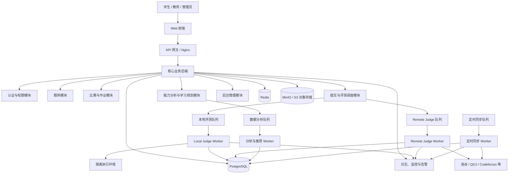

# 多源 OJ 教学与竞赛平台初版建设方案

> 文档版本：V0.2
> 编制日期：2026-07-12（修订于同日）
> 项目类型：多源 Online Judge、教学管理、在线竞赛与学习规划平台

---

## 1. 项目概述

### 1.1 项目目标

建设一个面向学校、教师和学生的综合性程序设计学习平台，统一管理本平台题目和第三方 OJ 题目，并提供：

1. 第三方 OJ 的 Remote Judge 能力；
2. 本平台题目录入与自主评测能力；
3. 本地题目、外部题目的统一题库管理；
4. 线上比赛、训练和作业功能；
5. 管理员、教师、学生等多角色权限体系；
6. 用户能力分析、薄弱知识点识别和学习规划推荐；
7. 班级、课程、作业、排行榜和教学统计功能。

### 1.2 平台定位

平台不是单纯的 OJ，而是由以下四部分组成：

* **统一题库平台**：聚合本地题目和第三方 OJ 题目；
* **统一评测平台**：支持本地评测和 Remote Judge；
* **教学管理平台**：支持教师、班级、作业和学习统计；
* **竞赛训练平台**：支持线上比赛、专项训练和个性化规划。

### 1.3 重要边界

“支持各大主要 OJ 的 Remote Judge”应理解为：

> 平台具备可扩展的 Remote Judge 适配器框架，并根据各 OJ 的官方 API、授权政策和技术条件逐个平台接入。

不能保证所有 OJ 都能稳定进行远程提交。部分平台只提供题目和提交记录查询 API，不提供提交代码 API。

例如，洛谷开放平台明确提供“评测即服务”，并提供题库导出数据，适合通过正式接口接入 Remote Judge。

Codeforces 当前官方 API 方法主要用于读取题目、比赛、排名和提交记录，官方方法列表中没有提交代码接口，因此初期应将其定位为“题目数据同步和原站跳转”，而不是稳定的服务器端 Remote Judge。

---

## 2. 总体建设原则

### 2.1 模块化而非一次性实现全部功能

第一版采用“模块化单体应用 + 独立 Worker”的架构，不建议一开始就建设大量微服务。

核心业务集中在一个后端项目中，以下高风险或高计算模块单独运行：

* 本地评测 Worker；
* Remote Judge Worker；
* 定时同步 Worker；
* 数据分析 Worker。

这样既能降低初期开发复杂度，也便于以后拆分为微服务。

### 2.2 本地评测与 Remote Judge 分离

两种评测模式使用统一提交入口，但底层流程完全分开：

```text
用户提交
   │
   ▼
统一提交服务
   │
   ├── 本地题目 ──→ Local Judge Worker ──→ 本地测试数据
   │
   └── 外部题目 ──→ Remote Judge Worker ──→ 第三方 OJ
```

### 2.3 业务平台与评测沙箱分离

运行用户代码的服务器必须和以下服务隔离：

* 主数据库；
* 用户服务；
* 管理后台；
* Remote Judge 账号；
* 对象存储管理接口。

公开运行用户提交代码属于高风险操作，不应直接在 Web 后端容器或数据库服务器中执行。

### 2.4 Remote Judge 必须遵守平台规则

Remote Judge 接入分为四个等级：

| 等级 | 模式       | 说明                |
| -- | -------- | ----------------- |
| A  | 官方评测 API | 第三方明确提供提交和查询接口    |
| B  | 官方授权适配   | 没有标准 API，但已取得平台授权 |
| C  | 非官方网页适配  | 模拟登录、提交和轮询，稳定性较差  |
| D  | 仅同步元数据   | 只同步题目、难度、标签和原题链接  |

不得将绕过验证码、Cloudflare、反自动化机制等行为作为正式系统能力。

---

## 3. 用户角色与权限设计

平台采用 RBAC，即基于角色的访问控制，同时支持针对学校、班级、比赛和题目的资源级权限。

### 3.1 学生端

学生可以：

* 注册和登录；
* 加入学校、课程和班级；
* 浏览公开题库；
* 查看教师布置的题目和作业；
* 提交代码并查看评测结果；
* 参加线上比赛；
* 查看个人做题记录；
* 查看知识点掌握程度；
* 获取训练计划和推荐题目；
* 绑定第三方 OJ 账号；
* 查看个人排行榜和班级排名。

### 3.2 教师端

教师可以：

* 创建和管理班级；
* 邀请、导入和移除学生；
* 创建本平台题目；
* 导入第三方 OJ 题目；
* 上传测试数据和配置评测规则；
* 创建作业、训练计划和线上比赛；
* 查看学生提交记录；
* 查看班级知识点掌握情况；
* 查看学生薄弱项和学习进度；
* 手动调整题目难度、标签和推荐范围；
* 导出成绩、排名和学习报告。

### 3.3 管理员端

管理员可以：

* 管理用户、教师和学校；
* 分配角色和权限；
* 审核题目；
* 管理题目来源和 OJ 适配器；
* 管理 Remote Judge 账号池；
* 查看评测队列和服务状态；
* 配置编程语言和编译器；
* 管理敏感词、公告和系统参数；
* 查看操作日志和安全日志；
* 封禁异常账号和限制提交频率；
* 管理服务器、Worker 和存储配额。

### 3.4 可扩展角色

后续可以增加：

* 题目审核员；
* 出题人；
* 比赛管理员；
* 助教；
* 学校管理员；
* 只读观察员。

---

## 4. 总体系统架构



---

## 5. 推荐技术栈

### 5.1 前端

建议采用：

```text
Vue 3
TypeScript
Vite
Vue Router
Pinia
Element Plus 或 Naive UI
ECharts
Monaco Editor
```

主要页面包括：

* 登录和注册；
* 题库；
* 题目详情；
* 在线代码编辑器；
* 提交记录；
* 比赛；
* 排行榜；
* 教师工作台；
* 学生学习报告；
* 管理后台。

Monaco Editor 用于实现类似 VS Code 的在线代码编辑体验。

### 5.2 核心后端

建议采用：

```text
Node.js
NestJS
TypeScript
Prisma ORM
PostgreSQL
Redis
BullMQ
```

选择 NestJS 的主要原因：

* 前后端均可使用 TypeScript；
* 模块边界清晰；
* 适合权限、队列、WebSocket 和后台任务；
* 便于后续拆分服务；
* 对前端开发者的学习成本相对较低。

### 5.3 评测 Worker

评测 Worker 的代码执行层有两个推荐方案，按场景选择：

**方案 A：go-judge（推荐）**

go-judge 是国内 OJ 社区广泛使用的开源沙箱，基于 cgroups + seccomp，提供 gRPC API。优势：
- 轻量级，部署简单，Go 单二进制；
- 国内社区活跃，文档和案例丰富；
- 性能优秀，内存占用低；
- 支持精确的资源限制（CPU、内存、进程数、文件大小等）。

在 go-judge 之上，需要自行实现测试点调度、分组计分和 Special Judge 逻辑。

**方案 B：Judge0**

Judge0 提供更完整的「代码执行即服务」HTTP API。优势：
- 开箱即用，提供创建提交、排队执行和结果查询的 REST API；
- 已内置多语言支持；
- 文档完善，国际社区活跃。

劣势：
- 基于 isolate（而非 cgroups），资源限制精度略低；
- 定制化难度较大；
- 资源占用更高（Ruby on Rails + 多组件）。

> **建议**：初版推荐 go-judge（方案 A）。其性能、可控性和国内社区支持更适合本平台长期发展。如果有快速原型需求，可先用 Judge0 验证流程，后续替换为 go-judge。

无论选择哪个方案，完整 OJ 仍需自行实现：

* 题目管理；
* 测试数据管理；
* 多测试点调度；
* 分组计分；
* Special Judge；
* 比赛排名；
* 提交记录；
* 权限控制。

### 5.4 数据与基础设施

| 用途         | 推荐技术                            |
| ---------- | ------------------------------- |
| 关系数据       | PostgreSQL                      |
| 任务队列、缓存    | Redis（开启 AOF 持久化 + RDB 快照）      |
| 测试数据、图片、附件 | MinIO 或兼容 S3 的对象存储              |
| 日志搜索       | Loki，后期可使用 OpenSearch           |
| 服务监控       | Prometheus + Grafana            |
| 错误跟踪       | Sentry                          |
| 反向代理       | Nginx                           |
| 容器管理       | Docker Compose，后期可升级 Kubernetes |
| 自动部署       | GitHub Actions 或 GitLab CI      |

> **Redis 持久化说明**：BullMQ 依赖 Redis 存储任务队列。必须开启 Redis AOF 持久化（appendfsync everysec），防止 Redis 重启后丢失排队中的提交任务。生产环境还应配置 Redis Sentinel 或 Cluster 实现高可用，避免单点故障导致评测中断。

---

## 6. 核心功能模块

### 6.1 认证与用户模块

包含：

* 用户注册；
* 邮箱或手机号登录；
* 密码重置；
* JWT Access Token（短期，15分钟）；
* Refresh Token（长期，7天，存储在 HttpOnly Secure SameSite Cookie 中）；
* Access Token 仅存于内存（不存 localStorage，防止 XSS 窃取）；
* 单点登录预留；
* 第三方 OJ 账号绑定；
* 角色和权限；
* 学校、课程、班级关系；
* 登录设备和会话管理；
* 登录安全审计。

> **Token 安全策略**：Access Token 只存在前端 JavaScript 内存变量中，页面刷新后通过 Refresh Token（HttpOnly Cookie）静默获取新 Access Token。Refresh Token 存储在服务端校验的 HttpOnly Cookie 中，浏览器 JS 无法访问，从根本上防止 XSS 窃取 Token。Refresh Token 使用一次后失效（Rotation），检测到重放时立即作废该用户所有会话。

### 6.2 统一题库模块

所有题目使用统一的数据模型，但根据来源分为：

```text
LOCAL：本平台原创或完整导入的题目
REMOTE：通过第三方 OJ 进行评测的题目
EXTERNAL：只展示信息并跳转原站的题目
HYBRID：本地有题面，但评测由第三方完成
```

题库支持：

* 标题搜索；
* 来源筛选；
* 难度筛选；
* 知识点筛选；
* 通过率筛选；
* 学校和班级私有题目；
* 公开和私有状态；
* 题目版本管理；
* 题目审核；
* 重复题检测；
* 批量导入；
* 题单管理；
* 收藏和错题本。

### 6.3 本平台题目录入模块

教师或出题人可以录入：

* 题目标题；
* 题目描述；
* 输入格式；
* 输出格式；
* 样例输入输出；
* 数据范围；
* 提示；
* 来源；
* 难度；
* 知识点；
* 时间限制；
* 内存限制；
* 允许语言；
* 测试数据；
* 标准程序；
* Special Judge；
* 计分方式。

题目状态：

```text
DRAFT       草稿
REVIEWING   审核中
PUBLISHED   已发布
HIDDEN      已隐藏
ARCHIVED    已归档
```

#### 题目版本策略

每次修改已发布（PUBLISHED）题目的题面、测试数据或评测配置时，系统自动创建新版本（递增版本号），原有版本保持不变。提交记录关联 `problem_version_id`，确保：
- 已结束的比赛/作业不受题目修改影响，始终使用参赛时的版本；
- 历史提交结果可复现（回滚到对应版本的测试数据重测）。

草稿状态（DRAFT）的题目修改不创建新版本，直到首次发布。

#### 题目难度评级

题目难度采用「人工标注 + 数据校准」的混合策略：

1. **初始标注**：出题人或审核员录入时手动标注难度（入门 / 普及- / 普及/提高- / 提高/省选- / 省选/NOI）；
2. **数据校准**：收集足够提交数据后（≥ 50 次独立用户提交），根据通过率自动建议难度调整；
3. **审核确认**：自动建议由题目管理员审核确认后生效。

难度校准参考区间（可根据实际数据调整）：

| 难度 | 预期通过率 |
| -- | ----- |
| 入门 | > 70% |
| 普及- | 55%–70% |
| 普及 | 40%–55% |
| 提高- | 25%–40% |
| 提高 | 12%–25% |
| 省选及以上 | < 12% |

### 6.4 评测模块

统一评测结果：

```text
PENDING
QUEUING
COMPILING
RUNNING
ACCEPTED
WRONG_ANSWER
TIME_LIMIT_EXCEEDED
MEMORY_LIMIT_EXCEEDED
RUNTIME_ERROR
COMPILE_ERROR
OUTPUT_LIMIT_EXCEEDED
PRESENTATION_ERROR
SYSTEM_ERROR
CANCELLED
REMOTE_ERROR
```

本地评测基本流程：

```text
提交代码
  ↓
创建 Submission
  ↓
写入 Redis 队列
  ↓
Judge Worker 获取任务
  ↓
创建临时隔离环境
  ↓
编译
  ↓
逐个运行测试点
  ↓
输出比较或 Special Judge
  ↓
汇总得分和状态
  ↓
保存结果
  ↓
通过 WebSocket 推送前端
```

第一阶段支持：

* C++；
* C；
* Python；
* Java；
* 普通标准输入输出题；
* 忽略行末空格的文本比较；
* 测试点分组；
* 部分分。

后续支持：

* Special Judge；
* 交互题；
* 提交答案题；
* 多文件题；
* 通信题；
* 自定义 Checker；
* Hack 数据。

### 6.5 Remote Judge 模块

Remote Judge 采用插件式适配器。

建议定义统一接口：

```typescript
interface RemoteJudgeAdapter {
  getPlatformInfo(): Promise<PlatformInfo>;

  getCapabilities(): Promise<RemoteCapabilities>;

  fetchProblem(remoteProblemId: string): Promise<RemoteProblem>;

  validateCredential(credentialId: string): Promise<boolean>;

  submit(request: RemoteSubmitRequest): Promise<RemoteSubmission>;

  getStatus(remoteSubmissionId: string): Promise<RemoteJudgeResult>;

  cancel?(remoteSubmissionId: string): Promise<void>;

  healthCheck(): Promise<AdapterHealth>;
}
```

能力描述：

```typescript
interface RemoteCapabilities {
  canFetchMetadata: boolean;
  canFetchStatement: boolean;
  canSubmit: boolean;
  canReadResult: boolean;
  canReadTestDetails: boolean;
  supportsContestProblems: boolean;
  supportsMultipleFiles: boolean;
  officialApi: boolean;
}
```

每个平台单独实现适配器：

```text
remote-adapters/
├── luogu/
├── qoj/
├── codeforces/
├── atcoder/
├── codechef/
├── leetcode/
└── shared/
```

#### 初版平台接入策略

| 平台         | 初版模式                | 优先级 | 说明                 |
| ---------- | ------------------- | --: | ------------------ |
| 洛谷         | 官方 Remote Judge API |  P0 | 使用开放平台正式接口         |
| 本平台        | 本地评测                |  P0 | 使用自建评测 Worker      |
| QOJ        | 元数据同步或授权适配          |  P1 | 接入前确认授权和稳定性        |
| Codeforces | 元数据同步、账号绑定、原站跳转     |  P1 | 官方 API 暂无提交方法      |
| AtCoder    | 元数据同步、原站跳转          |  P2 | Remote Judge 需单独评估 |
| CodeChef   | 元数据同步、原站跳转          |  P2 | Remote Judge 需单独评估 |
| LeetCode   | 账号数据同步或原站跳转         |  P2 | 需确认接口和转载政策         |

#### Remote Judge 账号池

Remote Judge 不应直接使用学生个人密码进行集中提交。

平台需要建立：

* 平台评测账号池；
* 账号状态管理；
* Cookie 和 Token 加密存储；
* 单账号并发限制；
* 提交冷却时间；
* 账号异常检测；
* 自动暂停；
* 人工重新验证；
* 凭据轮换；
* 操作审计。

所有凭据只能在 Remote Judge Worker 中解密，不能发送到浏览器，也不能写入普通日志。

#### Remote Judge 稳定性设计

必须实现：

* 请求限流；
* 指数退避；
* 超时；
* 重试上限；
* 幂等提交；
* 熔断；
* 平台健康检查；
* 账号健康检查；
* 队列积压监控；
* HTML 页面结构变化报警；
* 结果状态兼容层。

Remote Judge 任务应保存：

```text
本平台提交 ID
第三方平台
第三方题号
第三方提交 ID
使用的账号 ID
提交时间
最后查询时间
查询次数
原始状态
统一状态
错误原因
```

### 6.6 比赛模块

比赛类型：

* ACM/ICPC 模式；
* IOI 分数模式；
* 作业模式；
* 训练模式；
* 个人虚拟赛；
* 班级内部赛；
* 学校公开赛。

比赛配置：

* 标题；
* 描述；
* 开始和结束时间；
* 报名时间；
* 公开或私有；
* 参赛密码；
* 允许班级；
* 允许用户；
* 比赛题目；
* 每题分值；
* 提交次数；
* 罚时；
* 封榜时间；
* 是否显示实时结果；
* 是否允许赛后补题；
* 是否启用代码查重。

比赛题目可以混合本地题目和 Remote Judge 题目，但正式比赛应优先使用本地评测题目。

原因是第三方 OJ 可能出现：

* 请求延迟；
* 服务不可用；
* 提交限制；
* 账号异常；
* 判题队列拥堵；
* 结果回传延迟。

Remote Judge 更适合训练、作业和非正式比赛。正式计分比赛若使用 Remote Judge，应在规则中明确第三方服务故障的处理方法。

### 6.7 教师教学模块

教师端主要功能：

* 创建课程；
* 创建班级；
* 批量导入学生；
* 创建作业；
* 从统一题库选择题目；
* 设置截止时间；
* 设置补交规则；
* 设置通过条件；
* 查看完成率；
* 查看每道题通过率；
* 查看错误类型分布；
* 查看学生知识点掌握情况；
* 查看长期未完成学生；
* 导出 Excel 或 PDF 报告。

教师可以创建题单：

```text
题单名称
适用年级
难度范围
前置知识
目标知识点
建议完成时间
题目顺序
完成条件
```

---

## 7. 统一数据模型

### 7.1 用户与组织

| 表                   | 作用          |
| ------------------- | ----------- |
| `users`             | 用户基础信息      |
| `roles`             | 角色          |
| `permissions`       | 权限点         |
| `user_roles`        | 用户角色关联      |
| `organizations`     | 学校或机构       |
| `courses`           | 课程          |
| `classes`           | 班级          |
| `class_members`     | 班级成员        |
| `user_sessions`     | 登录会话        |
| `external_accounts` | 第三方 OJ 账号绑定 |

### 7.2 题库

| 表                     | 作用                      |
| --------------------- | ----------------------- |
| `problems`            | 统一题目主表                  |
| `problem_sources`     | 题目来源（LOCAL/REMOTE/EXTERNAL/HYBRID） |
| `problem_versions`    | 题面版本（每次修改生成新版本，已发布版本不可变） |
| `problem_statements`  | 多语言题面                   |
| `problem_tags`        | 题目知识点和标签                |
| `problem_limits`      | 时间、内存和语言限制              |
| `testdata_packages`   | 测试数据包（关联 problem_version_id） |
| `test_groups`         | 测试点分组                   |
| `checkers`            | Checker 或 Special Judge |
| `problem_permissions` | 题目访问权限                  |
| `problem_import_jobs` | 导入和同步任务                 |
| `problem_lists`       | 题单（教师或用户创建的题目集合）       |
| `problem_list_items`  | 题单中的题目和排序               |
| `user_favorites`      | 用户收藏的题目                 |
| `user_wrong_book`     | 用户错题本（记录做错的题目和错误类型）    |
| `problem_reviews`     | 题目审核记录（审核人、意见、状态变更）    |

### 7.3 提交与评测

| 表                    | 作用       |
| -------------------- | -------- |
| `submissions`        | 提交主记录（含 `problem_version_id` 锁定评测时的题目版本） |
| `submission_sources` | 源代码      |
| `submission_cases`   | 各测试点结果   |
| `judge_tasks`        | 本地评测任务   |
| `remote_judge_jobs`  | 远程评测任务   |
| `remote_submissions` | 第三方提交映射  |
| `judge_nodes`        | 评测节点     |
| `judge_languages`    | 编程语言和编译器 |
| `verdict_mappings`   | 第三方状态映射  |

### 7.4 比赛和作业

| 表                        | 作用     |
| ------------------------ | ------ |
| `contests`               | 比赛     |
| `contest_problems`       | 比赛题目   |
| `contest_participants`   | 参赛者    |
| `contest_submissions`    | 比赛提交   |
| `contest_rank_snapshots` | 排名快照   |
| `assignments`            | 作业     |
| `assignment_problems`    | 作业题目   |
| `assignment_students`    | 学生完成状态 |

### 7.5 能力分析与规划

| 表                          | 作用       |
| -------------------------- | -------- |
| `knowledge_points`         | 知识点      |
| `knowledge_relations`      | 知识点前置关系  |
| `problem_knowledge_points` | 题目和知识点关联 |
| `user_skill_profiles`      | 用户能力向量   |
| `user_problem_metrics`     | 用户单题行为统计 |
| `learning_plans`           | 学习规划     |
| `learning_plan_items`      | 规划中的训练项  |
| `recommendation_logs`      | 推荐记录     |
| `recommendation_feedback`  | 用户反馈     |

### 7.6 系统与审计

| 表                    | 作用       |
| -------------------- | -------- |
| `audit_logs`         | 操作审计日志（操作人、操作类型、目标资源、时间、IP、结果） |
| `login_logs`         | 登录记录（用户、IP、设备、成功/失败） |
| `announcements`      | 系统公告     |
| `system_configs`     | 系统参数配置   |
| `sensitive_words`    | 敏感词库     |
| `oj_access_evaluations` | 第三方 OJ 接入评估记录和审核时间 |
| `rate_limit_records` | 限流记录     |

---

## 8. 用户能力分析与学习规划

### 8.1 数据来源

能力分析使用以下数据：

* 题目难度；
* 题目知识点；
* 是否通过；
* 提交次数；
* 首次通过时间；
* 错误类型；
* 单题耗时；
* 最近训练频率；
* 比赛表现；
* 相似难度题目的通过率；
* 提示和题解使用情况；
* 是否独立完成。

不得只根据“总 AC 数量”评价用户水平。

### 8.2 初版能力模型

第一版不需要立即使用复杂机器学习模型，可以先采用可解释的规则模型。

每个用户维护一个知识点能力值：

```text
用户能力档案
├── 基础语法：82
├── 模拟：76
├── 枚举：69
├── 二分：54
├── 动态规划：38
├── 图论：31
└── 数据结构：45
```

能力值受到以下因素影响：

```text
完成题目难度
是否首次通过
错误提交次数
完成时间
近期表现
知识点覆盖数量
题目是否重复完成
```

### 8.3 推荐逻辑

初版推荐采用规则引擎：

1. 找出能力最低但已具备前置知识的知识点；
2. 选择难度略高于用户当前水平的题目；
3. 避免重复推荐已熟练掌握的题目；
4. 控制同一知识点的连续题量；
5. 混合基础巩固题、当前训练题和挑战题；
6. 根据用户最近完成率动态调整数量。

建议训练结构：

```text
50% 当前薄弱知识点
30% 已学习知识点巩固
20% 略高于当前水平的挑战题
```

### 8.4 学习规划输出

平台生成：

* 今日训练；
* 7 天训练计划；
* 30 天阶段计划；
* 比赛前专项训练；
* 错题重做计划；
* 长期未练知识点提醒。

示例：

```text
本周目标：掌握二分答案基础模型

周一：二分查找基础题 3 道
周二：边界处理专项 3 道
周三：二分答案入门题 2 道
周四：错题复习
周五：综合题 2 道
周六：限时训练
周日：复盘和能力评估
```

### 8.5 后续模型升级

数据量足够后，可以逐步引入：

* Elo 或 Glicko 风格能力评分；
* Item Response Theory；
* Bayesian Knowledge Tracing；
* 知识图谱；
* 协同过滤；
* Learning to Rank；
* 大语言模型生成解释性学习建议。

无论使用何种模型，都应保留推荐依据，例如：

```text
推荐原因：
你最近在“二分边界”知识点上完成了 5 道题，
其中 3 道出现边界错误，本题难度略高于你当前水平，
适合作为下一阶段巩固训练。
```

---

## 9. 核心 API 初步设计

### 9.1 用户与认证

```http
POST   /api/auth/register
POST   /api/auth/login
POST   /api/auth/refresh
POST   /api/auth/logout
POST   /api/auth/change-password
GET    /api/users/me
PATCH  /api/users/me
GET    /api/users/:id/profile
POST   /api/external-accounts/bind
GET    /api/external-accounts
DELETE /api/external-accounts/:id
```

### 9.2 题库

```http
GET    /api/problems
POST   /api/problems
GET    /api/problems/:id
PATCH  /api/problems/:id
DELETE /api/problems/:id
PATCH  /api/problems/:id/status          # 修改题目状态（替代 POST .../publish）
POST   /api/problems/import              # 批量导入
POST   /api/problems/sync                # 同步第三方题目
POST   /api/problems/:id/testdata        # 上传测试数据
GET    /api/problems/:id/testdata         # 查看测试数据信息
POST   /api/problems/:id/favorite         # 收藏题目
DELETE /api/problems/:id/favorite         # 取消收藏
GET    /api/problem-lists                 # 题单列表
POST   /api/problem-lists                 # 创建题单
```

### 9.3 提交

```http
POST   /api/submissions
GET    /api/submissions/:id
GET    /api/submissions
POST   /api/submissions/:id/rejudge
GET    /api/submissions/:id/cases
WS     /ws/submissions/:id                # WebSocket：实时评测状态推送
```

### 9.4 比赛

```http
GET    /api/contests
POST   /api/contests
GET    /api/contests/:id
PATCH  /api/contests/:id
POST   /api/contests/:id/register
GET    /api/contests/:id/rank
GET    /api/contests/:id/problems
GET    /api/contests/:id/submissions      # 当前用户的比赛提交
```

### 9.5 教学与分析

```http
POST   /api/classes
POST   /api/classes/:id/students/import
POST   /api/assignments
GET    /api/assignments/:id/statistics
GET    /api/analytics/users/:id/skills
GET    /api/analytics/classes/:id
GET    /api/learning-plans/current
POST   /api/learning-plans/generate
```

### 9.6 文件上传

```http
POST   /api/files/upload                  # 通用文件上传（头像、题面图片等）
POST   /api/files/upload/testdata         # 测试数据包上传（额外校验，限制 zip 格式）
```

### 9.7 管理后台

```http
GET    /api/admin/users
PATCH  /api/admin/users/:id/roles
GET    /api/admin/judge-queue             # 评测队列状态
GET    /api/admin/judge-nodes             # 评测节点状态
GET    /api/admin/audit-logs
GET    /api/admin/system-configs
PATCH  /api/admin/system-configs
POST   /api/admin/announcements
```

### 9.8 WebSocket 实时通信设计

#### 连接认证

WebSocket 连接通过 URL 参数传递 Access Token 进行认证：

```text
ws://host/ws/submissions/:id?token=<access_token>
```

服务端在 WebSocket 握手阶段校验 Token 有效性，校验失败则拒绝连接。

#### 消息格式

服务端 → 客户端推送评测状态变更：

```json
{
  "type": "judge.status",
  "submissionId": "sub_abc123",
  "status": "RUNNING",
  "currentCase": 5,
  "totalCases": 20,
  "timestamp": "2026-07-12T10:30:00Z"
}
```

评测完成：

```json
{
  "type": "judge.complete",
  "submissionId": "sub_abc123",
  "status": "ACCEPTED",
  "score": 100,
  "timeUsed": 45,
  "memoryUsed": 16384,
  "cases": [
    {"index": 1, "status": "ACCEPTED", "time": 12, "memory": 8192},
    {"index": 2, "status": "ACCEPTED", "time": 15, "memory": 16384}
  ]
}
```

评测异常：

```json
{
  "type": "judge.error",
  "submissionId": "sub_abc123",
  "status": "SYSTEM_ERROR",
  "message": "评测节点异常，请稍后重试"
}
```

#### 重连机制

前端 WebSocket 断线后采用指数退避重连（1s → 2s → 4s → 8s，上限 30s）。重连时使用当前提交 ID 重新订阅，服务端推送最新已知状态。

#### 连接管理

- 每个用户最多维持 5 个并发 WebSocket 连接；
- 提交完成后（状态为终态），WebSocket 连接在 30 秒后由服务端主动关闭；
- 连接心跳：服务端每 30 秒发送 ping，客户端 10 秒内未响应 pong 则断开。

---

## 10. 安全设计

### 10.1 用户代码隔离

Judge Worker 至少需要限制：

* CPU 时间；
* 实际运行时间；
* 内存；
* 进程数量；
* 文件大小；
* 输出大小；
* 磁盘空间；
* 系统调用；
* 网络访问；
* 可访问目录；
* 容器权限。

建议默认：

```text
禁用外网
只读根文件系统
临时工作目录
非 root 用户
限制进程数
限制 CPU 和内存
任务完成后立即销毁环境
```

### 10.2 服务器隔离

推荐至少分成两类节点：

```text
业务节点：
前端、API、数据库、Redis、对象存储

评测节点：
编译器、沙箱、Judge Worker
```

评测节点不能直接访问生产数据库。它只能通过受限接口获取任务并提交结果。

### 10.3 Remote Judge 凭据安全

* Token、Cookie 和密码必须加密；
* 不得在日志中记录完整凭据；
* 不得返回给前端；
* 使用独立密钥管理；
* 每次解密需要审计；
* 管理员只能看到脱敏信息；
* 定期检查过期和异常账号。

### 10.4 业务安全

需要实现：

* API 限流；
* 登录失败限制；
* CSRF 防护；
* XSS 过滤；
* SQL 注入防护；
* 文件类型校验；
* 测试数据压缩包解压安全；
* 操作审计；
* 题目权限校验；
* 私有比赛访问校验；
* 敏感配置脱敏。

### 10.5 内容与平台合规

同步第三方题目时，需要分别确认：

* API 使用规则；
* 题目版权；
* 是否允许转载完整题面；
* 是否允许保存图片；
* 是否允许自动提交；
* 是否允许使用账号池；
* 请求频率限制；
* 是否需要商业授权。

平台应保存每个 OJ 的接入评估结果和最近审核时间。

### 10.6 测试策略

评测平台涉及不可信代码执行，测试策略必须覆盖安全边界。

**测试金字塔**：

```text
        /\
       /E2E\          端到端：完整提交→评测流程
      /------\
     /集成测试 \        集成：API + 数据库 + 队列 + Worker
    /----------\
   /  单元测试    \      单元：业务逻辑、权限、评测结果判定
  /--------------\
```

**各层测试要求**：

| 层次 | 范围 | 工具建议 | 覆盖率目标 |
|------|------|----------|------------|
| 单元测试 | 业务逻辑、权限校验、结果判定、计分规则 | Vitest / Jest | ≥ 80% |
| 集成测试 | API 端点、数据库操作、队列消费、Worker 调度 | Supertest + Testcontainers | 关键路径全覆盖 |
| 沙箱安全测试 | 资源限制、系统调用过滤、逃逸测试 | 专用安全测试脚本 | 每个语言和沙箱配置 |
| E2E 测试 | 用户关键路径（注册→做题→查看结果） | Playwright | 核心流程 ≥ 5 条 |
| 压力测试 | 并发提交、队列积压、数据库连接池 | k6 / Artillery | 每次发版前 |

**安全测试特别要求**：

评测沙箱必须通过以下安全测试才能上线：

1. Fork Bomb 测试（进程数限制）；
2. 内存耗尽测试（OOM 限制）；
3. 文件系统写满测试（磁盘配额）；
4. 网络访问测试（外网隔离）；
5. 系统调用逃逸测试（seccomp 规则完整性）；
6. 无限循环测试（CPU 时间限制）；
7. `/proc` 和 `/sys` 访问测试；
8. Docker Socket 挂载测试。

> 每次沙箱配置变更后必须重新通过上述安全测试。

---

## 11. 部署方案

### 11.1 开发环境

开发者电脑通过 Docker Compose 启动：

```text
frontend
backend
postgresql
redis
minio
judge-orchestrator
judge-worker
```

第三方 Remote Judge 使用测试账号和独立测试环境。

### 11.2 初期生产环境

最小可用生产环境建议使用三台服务器（或两台服务器 + 云数据库）。

#### 服务器 A：业务服务器

运行：

* Nginx；
* 前端；
* 后端 API；
* Remote Judge Worker；
* 定时同步 Worker。

#### 服务器 B：数据服务器（或用云数据库替代）

运行：

* PostgreSQL（主库）；
* Redis（开启 AOF 持久化）；
* MinIO。

> **注意**：如果使用云服务商的托管 PostgreSQL 和托管 Redis，可将服务器 B 取消，大幅降低运维负担。推荐初期使用云数据库。

#### 服务器 C：评测服务器

运行：

* Judge Worker；
* 编译器；
* 代码沙箱；
* 临时执行环境。

```text
域名
  ↓
Nginx（服务器 A）
  ↓
业务 API ──→ PostgreSQL / Redis / MinIO（服务器 B 或云服务）
  │
  ├──→ Remote Judge Worker ──→ 第三方 OJ
  │
  └──→ 评测任务队列 ──→ 独立评测服务器（服务器 C）
```

**服务器最低配置建议**：

| 服务器 | CPU | 内存 | 磁盘 | 说明 |
|--------|-----|------|------|------|
| 业务服务器 | 4核 | 8 GB | 100 GB SSD | Nginx + API + 前端 |
| 数据服务器 | 4核 | 16 GB | 200 GB SSD | PostgreSQL + Redis + MinIO |
| 评测服务器 | 4核 | 8 GB | 100 GB SSD | 评测 Worker，CPU密集型可增加核心数 |

### 11.3 扩容方案

用户增长后拆分为：

```text
负载均衡节点
Web/API 节点 × N
PostgreSQL 主从或托管数据库
Redis 高可用
对象存储
本地 Judge Worker × N
Remote Judge Worker × N
分析 Worker × N
监控和日志节点
```

Judge Worker 可以根据队列长度水平扩容。

---

## 12. 开发阶段规划

### 阶段 0：需求和技术验证（2-4 周）

目标：

* 确定支持的平台列表；
* 核对第三方 OJ 接入规则；
* 验证本地沙箱（完成选型：Judge0 vs go-judge 对比测试）；
* 验证洛谷官方 Remote Judge（完成接口可行性验证）；
* 设计统一题目和提交模型；
* 完成关键路径技术原型（注册→选题→提交→评测→结果展示）。

产出：

* 需求规格说明书；
* 数据库 ER 图；
* API 接口文档；
* Remote Judge 能力矩阵；
* 评测安全方案；
* 沙箱选型报告（性能、安全性、可维护性对比）；
* 可运行的技术原型（含前端→API→Judge Worker 全链路）。

技术原型验证标准：
1. 用户可注册登录；
2. 可创建题目并上传测试数据；
3. 可提交 C++ 代码并获得评测结果；
4. 评测在隔离沙箱中执行。

### 阶段 1：基础平台 MVP（6-8 周）

实现：

* 注册和登录（含 JWT + Refresh Token，HttpOnly Cookie 存储策略）；
* 学生、教师、管理员角色；
* 统一题库（含本地题目录入、外部题目元数据同步）；
* 测试数据上传；
* C++、Python、Java 基础评测；
* 提交记录与 WebSocket 实时推送；
* 洛谷官方 Remote Judge 基础接入（单一适配器，MVP 仅要求接入一个官方平台）；
* 管理后台；
* 基础日志和监控；
* 单元测试和集成测试框架搭建。

阶段 1 产出即为第一版 MVP，验收标准见第 13 章。

> **说明**：将 Remote Judge 的洛谷接入提前到 MVP 阶段（而非阶段 3），是因为它是平台核心差异化能力之一。阶段 3 扩展为多平台适配器框架和稳定性增强——这与 MVP 要求「接入一个官方 Remote Judge 平台」一致。MVP 阶段 Remote Judge 仅做基础接入（同步题目 + 提交 + 查询结果），限流、熔断、账号池等生产级特性在阶段 3 完善。

### 阶段 2：教学和比赛（6-8 周）

实现：

* 学校、课程和班级；
* 学生批量导入；
* 作业；
* ACM/ICPC 比赛；
* IOI 分数比赛；
* 排行榜；
* 封榜；
* 教师统计页面；
* 数据导出。

### 阶段 3：Remote Judge 生产化（4-6 周）

实现：

* Remote Judge 多平台适配器框架扩展（Codeforces、AtCoder 等元数据同步）；
* 外部题目同步（定时任务、增量更新）；
* 账号池管理系统；
* 请求限流、指数退避、熔断器；
* 平台健康监控和自动暂停；
* HTML 结构变更检测和报警；
* 凭据轮换和审计。

对于没有正式提交接口的平台，只同步题目元数据和提供原站跳转。

### 阶段 4：能力分析和规划（4-6 周）

实现：

* 知识点体系；
* 用户能力档案；
* 班级能力分布；
* 薄弱项识别；
* 规则式题目推荐；
* 7 天和 30 天学习规划；
* 推荐反馈；
* 学习报告。

### 阶段 5：生产强化（持续）

实现：

* Special Judge；
* 交互题；
* 多文件题；
* 代码查重；
* 反作弊；
* 高可用部署；
* 数据备份；
* 灾难恢复；
* 压力测试；
* 安全审计；
* 端到端测试覆盖。
* 性能基准建立和持续监控。

---

## 13. 第一版 MVP 验收标准

第一版上线时至少满足：

1. 学生、教师和管理员能够登录；
2. 管理员能够分配角色和权限；
3. 教师能够创建班级和导入学生；
4. 教师能够创建本地题目并上传测试数据；
5. 学生能够使用 C++、Python 或 Java 提交代码；
6. 平台能够返回 AC、WA、TLE、MLE、RE 和 CE；
7. 教师能够创建 ACM 模式线上比赛；
8. 平台能够管理本地题目和外部题目；
9. 至少完成一个官方 Remote Judge 平台接入；
10. 不支持 Remote Judge 的外部题目能够跳转原站；
11. 教师能够查看班级做题统计；
12. 学生能够查看基础能力雷达图和推荐题目；
13. 管理员能够查看评测队列、节点状态和错误日志；
14. 用户代码运行环境与业务服务器隔离；
15. 数据库、测试数据和配置能够定期备份。

---

## 14. 主要风险

| 风险               | 影响                | 应对方式               |
| ---------------- | ----------------- | ------------------ |
| 第三方 OJ 不提供提交 API | Remote Judge 无法实现 | 降级为元数据同步和原站跳转      |
| 网页结构变化           | 非官方适配器失效          | 适配器隔离、健康检查、自动暂停    |
| 验证码或风控           | 账号无法自动提交          | 不绕过安全措施，申请授权或停止接入  |
| 第三方服务故障          | 比赛结果延迟            | 正式比赛优先使用本地评测       |
| Redis 故障           | 排队任务丢失、评测中断       | AOF 持久化 + RDB 快照，生产环境配置 Sentinel/Cluster |
| 数据库单点故障          | 全平台不可用            | 初期使用云数据库自动备份，后期配置主从 |
| 用户代码攻击服务器        | 数据泄露或服务中断         | 独立评测节点和强沙箱         |
| 沙箱逃逸漏洞           | 服务器被控制            | 安全测试通过后方可上线，定期复测  |
| 测试数据泄露           | 题目失效              | 对象存储权限隔离和下载审计      |
| 推荐结果不准确          | 用户体验下降            | 先使用可解释规则，收集反馈后迭代   |
| 题目版权问题           | 内容下架或法律风险         | 保存来源和授权信息，优先展示原题链接 |
| 系统范围过大           | 开发周期失控            | 严格按照 MVP 阶段建设      |
| 团队技术栈不统一         | 维护成本高、问题定位困难      | 核心栈统一 TS/NestJS，评测 Worker 限定 Go 单一额外语言 |
| 题目版本与比赛冲突        | 比赛公平性受损           | 提交关联版本 ID，已发布题目修改后创建新版本 |

---

## 15. 最终技术路线建议

推荐采用：

```text
自主开发教学与业务平台
+
复用成熟的代码执行沙箱
+
建设统一 Judge Orchestrator
+
使用插件式 Remote Judge 适配器
```

不建议第一版完全从零开发 Linux 沙箱，也不建议把整个平台建立在非官方网页自动提交之上。

推荐的初始技术组合：

```text
前端：
Vue 3 + TypeScript + Vite + Monaco Editor

核心后端：
NestJS + TypeScript + Prisma

数据库：
PostgreSQL

任务队列：
Redis + BullMQ

文件存储：
MinIO

本地执行：
go-judge 沙箱（推荐）或 Judge0（快速原型阶段可选）

Remote Judge：
独立适配器 Worker

部署：
Docker Compose + Nginx

监控：
Prometheus + Grafana + Loki
```

初版应优先完成：

```text
用户与权限
→ 本地题库
→ 本地评测
→ 教师和班级
→ 比赛
→ 官方 Remote Judge
→ 能力分析和学习规划
```

其中，本地评测是平台的基础能力，Remote Judge 应作为可插拔扩展，而不能成为整个平台唯一的评测来源。
